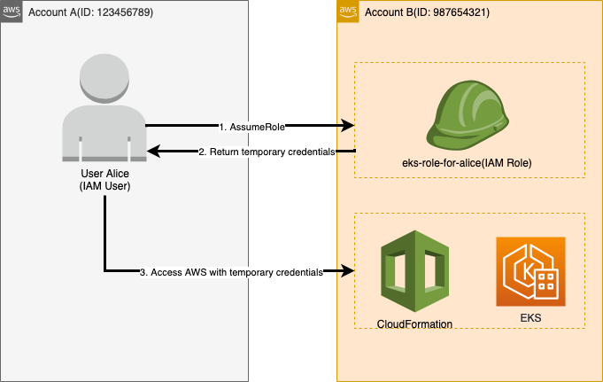

# K8S on AWS(AWS EKS)

## Deploy eks cluster

Dưới đây là hướng dẫn các bước để triển khai k8s cluster bằng eksctl:

Kịch bản: User Alice(IAM User) trong Account A sử dụng role từ Account B để tạo k8s cluster service trên Account B.



### Cài đặt tools:
- aws-cli: https://docs.aws.amazon.com/cli/latest/userguide/getting-started-install.html
- kubectl: https://docs.aws.amazon.com/eks/latest/userguide/install-kubectl.html
- eksctl: https://docs.aws.amazon.com/eks/latest/userguide/eksctl.html
- awsume: https://awsu.me/general/quickstart.html

### Configure AWS Alice credentials:
- Đầu tiên, trên account A cần tạo một IAM User(ví dụ ở đây tên là Alice), sau đó lấy được aws credentials là `Access Key` và `Access Secret`.
- Tiếp theo ta cần config credentials này vào dưới local để dùng aws-cli, chúng ta dùng command:
    ```bash
    $ aws configure

    AWS Access Key ID [None]: <your_access_key>
    AWS Secret Access Key [None]: <your_access_secret>
    Default region name [None]: ap-southeast-1
    Default output format [None]: json
    ```
    *Note*: Có thể tham khảo các cách config credentials khác [ở đây](https://docs.aws.amazon.com/cli/latest/userguide/cli-configure-quickstart.html)

-  Sau khi config credentials, ta cần verify aws và aws user
    ```bash
        $ aws --version # check verrsion
        aws-cli/2.4.13 Python/3.8.8 ...

        $ aws sts get-caller-identity # check identity
        {
            "UserId": "XXX",
            "Account": "XXX",
            "Arn": "arn:aws:iam::xxx:user/xxx"
        }
    ```
    Như vậy là OK, chúng ta đã config xong credentials của user Alice trên terminal.

### Configure Cross IAM Role:
-  Trên account B, chúng ta tạo một cross account IAM role với external id là Account's ID A.

    *Tips*: không nên enable MFA để dễ dàng cho việc switch role trên cli.

- Bước tiếp theo, chúng ta cần lưu lại ARN Role của Cross IAM Role vừa tạo.

- Lúc này, chúng ta cần mở file aws credentials trên PC tại đường dẫn `~/.aws/credentials`. Chúng ta sẽ thấy nội dung như sau:
    ```
    [default]
    aws_access_key_id = xxx
    aws_secret_access_key = xxx
    ```

    Đây chính là `Access Key` và `Access Secret` của user Alice vừa config ở trên

- Chúng ta sẽ append đoạn config dưới đây vào file credentials
    ```
    [<profile_name>]
    region = ap-southeast-1
    role_arn = <role_arn>
    source_profile = default
    ```
    *profile_name*: đặt tuỳ ý. dùng để khi switch role trên cli.\
    *role_arn*: là ARN Role của Cross IAM Role vừa tạo ở bước trên.\
    *source_profile*: có giá trị là `default`, tức là profile name cross account mà cụ thể là profile name của account user Alice, tức là giá trị `default` như bên trên.

- Switch role trên cli \
    Giả sử đặt profile_name vừa thêm vào là `account-b`. Chúng ta sẽ switch role từ user Alice trong account A sang account B bằng câu lệnh:
    ```
    $ asume account-b
    [account-b] Role credentials will expire 2022-03-10 22:00:17
    ```
    *Lưu ý*: session này chỉ tồn tại trong vòng 1h.

- Kiểm tra identity với command:
    ```
    $ aws sts get-caller-identity # check identity
    {
        "UserId": "<YYYY>",
        "Account": "<YYYY>",
        "Arn": "arn:aws:iam::<yyy>:user/<yyy>"
    }
    ```

    Lúc này đã thực hiện switch role thành công trên cli, chúng ta có thể truy xuất vào các dịch vụ aws trên account B với permission tương ứng.

### Deploy eks cluster by eksctl
Sau khi cấu hình, chúng ta sẽ triển khai eks cluster bằng eksctl

- Bước 1: Switch role sang account B
    ```bash
    $ awsume account-b
    ```

- Bước 2: Tạo cluster \
    Tạo eks cluster với name là `my-cluster` ở region `ap-southeast-1` và không khởi tạo nodegroups. Chúng ta có thể chạy command sau:

    ```bash
    $ eksctl create cluster --name my-cluster --region ap-southeast-1 --without-nodegroup
    ```
    Quá trình khởi tạo mất một vài phút, khi terminal xuất hiện output log như bên dưới thì eks cluster đã được khởi tạo thành công
    ```
    [✓]  EKS cluster "my-cluster" in "ap-southeast-1" region is ready
    ```

- Bước 3: Tạo workner node \
    Trong aws, workernode được gọi là nodegroup. Để tạo nodegroups cho cluster, chúng ta có thể sử dụng một trong hai cách sau:\
    -  Dùng command
        ```
        $ eksctl create nodegroup \
                    --cluster my-cluster \
                    --region ap-southeast-1 \
                    --name my-workers \
                    --node-type t3.medium \
                    --nodes 2 \
                    --ssh-access \
                    --ssh-public-key my-key
        ```
    - Dùng file config \
        Đầu tiên tạo file config có tên `eks-nodegroup.yaml`
        ```yaml
        apiVersion: eksctl.io/v1alpha5
        kind: ClusterConfig
        metadata:
            name: my-cluster
            region: ap-southeast-1
        managedNodeGroups:
        - name: my-workers
            amiFamily: Ubuntu2004
            instanceType: t3.medium
            desiredCapacity: 2
            ssh:
                publicKeyName: my-key
        ```
        Chạy command để tạo nodegroup
        ```bash
        $ eksctl create nodegroup --config-file eks-nodegroup.yaml
        ```
    Kết quả đều là tạo ra 2 worker node (là các EC2 instance) có cấu hình `t3.medium`.

- Bước 4: Tạo kubeconfig
Sau khi tạo worker node, một hệ thống k8s đã được triển khai thành công trên aws. Để có thể truy cập vào cluster này, chúng ta cần config dưới máy client bằng câu lệnh:

    ```bash
    $ aws eks update-config --region ap-southeast-1 --name my-cluster
    ```

- Bước 5: Kiểm tra cluster info từ client

    ```bash
    # kiểm tra cluster
    $ kubectl cluster-info

    # kiểm tra số worker node
    $ kubectl get nodes
    ```