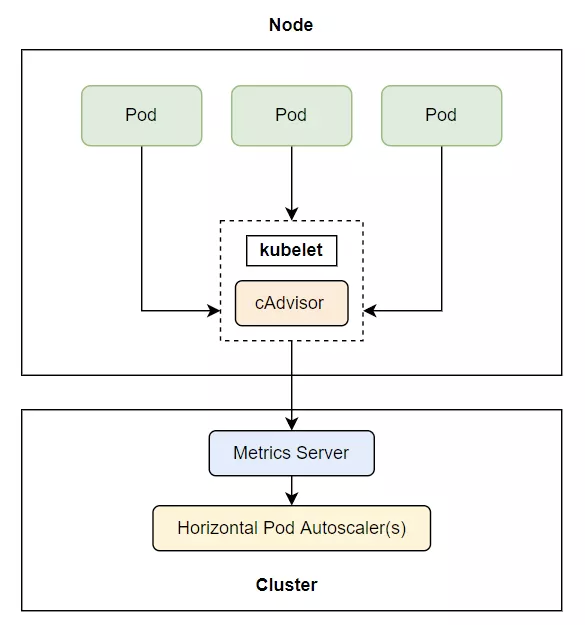
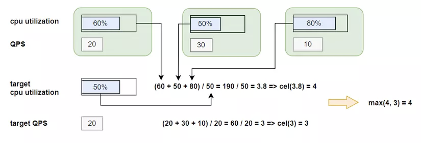

# K8S Auto Scaling

Khi nói về scale, chúng ta có 2 kiểu scale đó là horizontal scale và vertical scale.
- horizontal scale: tức là tăng/giảm số lượng node đang xử lý công việc lên nhiều hơn/ít hơn.
- vertical scale: tức là thay vì tăng số lượng node, chúng ta tăng resource(RAM, CPU) cho node đang xử lý công việc hiện tại.

Trong K8S,
- Để horizontal scale, chúng ta thay đổi số `replicas` trong Deployment hoặc Replicaset.
- Để vertical scale, chúng ta thay đổi resource request khi khởi tạo pod.

Tuy nhiên, phương pháp này không tối ưu vì phải cần phải thay đổi các thông số một cách thủ công. 

Do đó, k8s hỗ trợ monitor và tự động scale up/down hệ thống khi nhận thấy sự thay đổi các các metrics (Ram, CPU, ...) trên cluster. Ngoài ra, khi sử dụng k8s trên cloud, chúng ta còn được hỗ trợ để tự động scale node khi cần.

## Horizontal Pod AutoScaler(HPA)
- HPA là cách k8s tự động tăng/giảm số lượng `replicas` trong các scalable controller(Deployment, Replicaset, ...) khi nhận thấy các thay đổi về metrics.
- Công việc này được thực hiện bởi Horizontal Controller khi khởi tạo HPA resource.
- Controller này sẽ định kỳ kiểm tra các metrics, rồi tính toán `replicas` phù hợp dựa vào các metrics đó và metrics được chỉ định trong HPA. Từ đó, thay đổi `replicas` cho phù hợp.

1. Quá trình auto scale

    Quá trình auto scale được chia làm 3 giai đoạn:
    - Thu thập metrics của các pod được quản lý bởi các scalable resource.
    - Tính toán số lượng pod(`replicas`) cần thiết.
    - Thay đổi `replicas`

    a. Thu thập metrics

    - Horizontal Controller không thu thập metrics, thay vào đó nó sẽ lấy qua một thằng khác gọi là metrics server

    - Trên mỗi worker node, sẽ có một agent gọi là *cAdvisor*, nó có nhiệm vụ chính là thu thập metrics và đẩy về metrics server. Metrics server sẽ tổng hợp các metrics từ cả các worker khác và Horizontal Controller sẽ lấy metrics qua nó.

    

    b. Tính toán `replicas`
    - Tiếp theo, Horizontal Controller sẽ tính toán số lượng pod cần thiết dựa vào metrics thu thập được và metrics được chỉ định trong HPA resource.

    b1. Single metrics

    Nếu cấu hình chỉ dùng 1 metrics, số `replicas` sẽ được tính theo công thức
    ```
    desiredReplicas = ceil[sum(currentMetricValue) / desiredMetricValue ]	
    ```

    Ví dụ: tổng metrics hiện tại là 200m, metrics mong muốn là 100m thì công thức là:
    ```
    replicas = ceil[200m/100m] = 2
    ``` 
    Do đó, số lượng pod sẽ được scale up từ 1 lên 2

    b2. Multiple metrics

    Nếu cấu hình dùng nhiều metrics, Horizontal Controller nó sẽ tính toán số `replicas` của từng metric riêng lẻ, sau đó lấy giá trị max

    ```
    replicas = max([metric_1, metric_2,..., metric_n])
    ```

    

    Ví dụ: cấu hình 2 metrics (CPU Utilization, QPS) với 3 replicas, Horizontal Controller sẽ tính replicas cho CPU Utilization là 4 và replicas cho QPS là 3. Do đó, số replicas cuối cùng là max(4,3) = 4

    c. Thay đổi `replicas`
    - Sau khi tính được số pod cần thiết, Horizontal Controller sẽ cập nhật lại giá trị `replicas` trong scalable controller.
    - Hiện tại, HPA hỗ trợ để update các controller
        - Replicaset
        - Statefulset
        - Deployment

2. Scaling theo CPU

    Bây giờ chúng ta sẽ tạo một Deployment và HPA để auto scale theo số lượng CPU. 

    Tạo Deployment với config

    ```yaml
    # kubia-deployment.yaml

    apiVersion: v1
    kind: Pod
    metadata:
        name: kubia
    spec:
        relicas: 3
        selector: 
            app: kubia
        template:
            metadata: 
                labels:
                    app: kubia
            spec:
                containers:
                    - image: luksa/kubia:v1
                       name: nodejs
                       resource: 
                            request:
                                cpu: 100m
    ```
    Ở đây chúng ta tạo deployment với số replicas là 3, cpu request là 100m(milicore). Tiếp theo, chúng ta tạo một HPA resource.

    ```yaml
    # kubia-hpa.yaml

    apiVersion: autoscaling/v2beta2
    kind: HorizontalPodAutoscaler
    metadata:
        name: kubia-hpa
    spec:
        scaleTargetRef:
            apiVersion: apps/v1
            kind: Deployment
            name: kubia
        minReplicas: 1
        maxReplicas: 3
        metrics:
            - type: Resource
              resource:
                name: cpu
                target: 
                    type: Utilization
                    averageUtilization: 20

    ```
    Trong HPA, phải chỉ định loại controller để scale và metrics mong muốn.

    Tạo resource và kiểm tra thử:
    ```bash
    $ kubectl create -f kubia-deployment.yaml

    $ kubectl get deployment
    NAME               READY   UP-TO-DATE   AVAILABLE   AGE
    kubia-deployment   3/3     3            3           30s

    $ kubectl create -f kubia-hpa.yaml

    $ kubectl get hpa
    NAME        REFERENCE                     TARGETS         MINPODS   MAXPODS   REPLICAS   AGE
    kubia-hpa   Deployment/kubia-deployment   0%/20%          1         3         1          1m30s

    ```

    Lúc này, ta thấy số replicas sẽ là 1(không phải 3). Do ở đây pod chưa sử dụng bất kì cpu nào (0% cpu utilization), nên số pod tối thiểu phải là 1. Do đó, Horizontal Controller scale down số replicas từ 3 xuống 1.

    Đó là auto scale down, bây giờ chúng ta tạo kịch bản để scale up pod. Đầu tiên, cần expose service để client có thể send request vào.
    ```
    $ kubectl expose deployment kubia-deployment-scaling --port=80 --targetPort=8080
    ```

    Giờ chạy lệnh để xem quá trình scale up
    ```
    $ watch -n 1 kubectl get hpa,deployment
    ```

    Tiếp theo, mở một terminal khác và chạy lệnh 
    ```
    $ kubectl run -it --rm --restart=Never loadgenerator --image=busybox -- sh -c "while true; do wget -O - -q http://kubia; done"
    ```

    Quay lại terminal mà chạy lệnh `watch`, ta sẽ thấy lượng cpu utilization đã tăng lên, do đó số lượng replicas trong deployment cũng được tăng lên.

    
3. Scale theo memory

    Để scale theo ram cũng tương tự scale theo cpu, chỉ cần thay loại resource từ cpu sang ram
    ```yaml
    apiVersion: autoscaling/v2beta2
    kind: HorizontalPodAutoscaler
    metadata:
        name: kubia-hpa
    spec:
    scaleTargetRef:
        apiVersion: apps/v1
        kind: Deployment
        name: kubia-deployment
    minReplicas: 1
    maxReplicas: 3
    metrics:
        - type: Resource
        resource:
            name: memory
            target: 
            type: Utilization
            averageUtilization: 20
    ```

    Tuy nhiên, khi scale theo memory sẽ gặp nhiều vấn đề hơn là scale theo cpu, vì lượng ram sử dụng phụ thuộc rất nhiều cách viết ứng dụng. Do khi chúng ta scale up, lượng ram vẫn tăng dẫn đến scale đến maximum lượng pod trong một worker node làm cho node bị die. Do đó, khi scale theo memory cần phải xem xét nhiều yếu tố khác chứ không phải chỉ có HPA.

4. Scale theo các metrics khác

    Ngoài Ram và Cpu, k8s cũng hỗ trợ các loại metrics khác. Như 2 ví dụ ở trên, chúng ta đã dùng loại Resource với cpu và ram, còn có 2 loại khác là Pods và Object

    - Pods: scale dựa trên những metrics liên quan đến pod, có 2 metric hay sử dụng là QPS(Query per second) và number of message broker.

        ```yaml
        ...
        metrics:
            - type: Pods
        resource:
            metricName: qps
            targetAverageValue: 100
        ```

    - Object: scale dựa trên những metrics liên quan đến các resource khác trong cluster.
    Ví dụ scale theo số lượng request đến Ingress:

        ```yaml
        ...
        metrics:
            - type: Objects
              object:
                metric: 
                    name: requests-per-second
                describedObject:
                    apiVersion: networking.k8s.io/v1
                    kind: Ingress
                    name: ingress-service
                target:
                    type: Value
                    value: 5k

        ```

## Vertical Pod AutoScaler(VPA)

- Để dùng vertical auto scale, cần phải cài add-on lên cluster. Xem hướng dẫn cài đặt tại đây https://github.com/kubernetes/autoscaler/tree/master/vertical-pod-autoscaler

- Ví dụ file config VPA

    ```yaml
    apiVersion: autoscaling.k8s.io/v1
    kind: VerticalPodAutoscaler
    metadata:
        name: my-app-vpa
    spec:
        targetRef:
            apiVersion: "apps/v1"
            kind:       Deployment
            name:       my-app
        updatePolicy:
            updateMode: "Auto"
    ```

- Thành phần VPA
    - Recommender: Là thành phần sẽ monitor tài nguyên đã và đang sử dụng để đưa ra gợi ý giá trị cpu và memory cho container.
    - Updater: Là thành phần sẽ kiểm tra resource(cpu,memory) của pod có đúng với giá trị của recommender không. Nếu không thì nó sẽ kill và tạo Pod mới với memory và cpu theo đúng recommender
    - Admission plugin: thay đổi resource request của Pod.

- Update Policy

    Policy này là cách VPA áp dụng thay đổi lên pod. Đó là giá của thuộc tính `updatePolicy.updateMode`. Có 3 giá trị:

    - Off: Ở mode này, tức là VPA sẽ chỉ tạo ra 1 gơi ý về resource cho chúng ta mà không áp dụng nó lên Pod. 
    - Initial: ở mode này, sau khi VPA tạo gợi ý về resource, chỉ những pod tạo mới sẽ sử dụng gợi ý resource này, còn pod cũ vẫn giữ nguyên
    - Auto: giống với mode Initial nhưng những pod cũ sẽ phải reset để đúng với những gợi ý về resource.

## Cluster Autoscaler(CA)

Trong trường hợp, khi chúng ta scale đến hết resource hoặc maximum pod trên cluster thì sao? Lúc này giải pháp duy nhất đó là phải thêm các worker node vào cluster. 

Chúng ta có thể config quá trình này tự động khi sử dụng k8s trên cloud. 

Khi 1 pod mới được tạo ra mà không còn worker node có thể chứa nó nữa thì CA sẽ tự động tạo và join node vào cluster. Lúc này, pod sẽ được deploy tới node mới. Đó là quá trình scale up.

CA sẽ scale down một node khi:
- Hơn 50% Resource usage không được sử dụng. Tức là cộng CPU và Mem của tất cả các pod lại mà nhỏ hơn 50%.
- Hoặc tất cả các Pod hiện tại của node đó có thể được di chuyển sang một node khác mà không gặp vấn đề.

Quá trình scale down node, CA sẽ đánh dấu node đó unschedulable, sau đó move toàn bộ pod sang node khác rồi report đến cloud provider để xoá node đi.