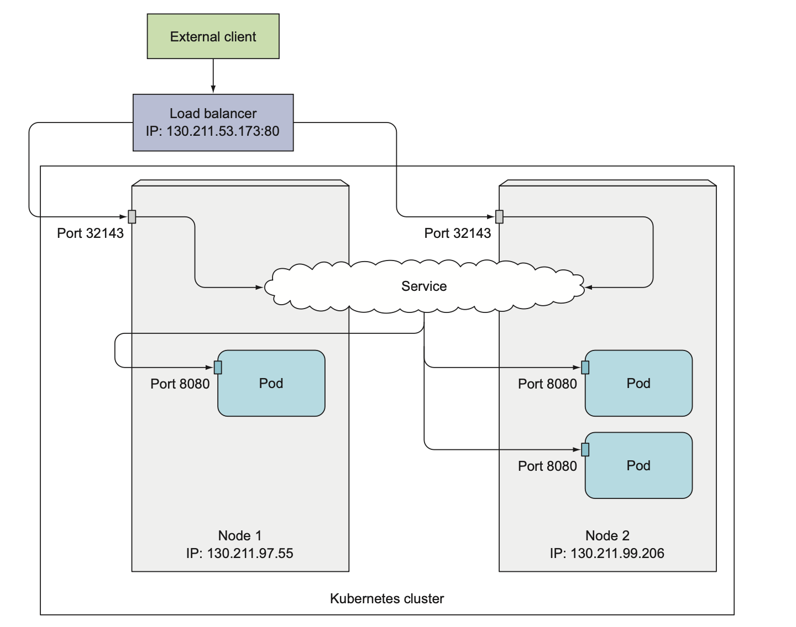

# Services

Service cũng là một resource trong kubernetes, nó tạo ra 1 endpoint cho nhóm các pod phía sau.

Mỗi service sẽ có một IP address và port không đổi, chỉ trừ khi nó bị xoá đi và tạo lại.

Client muốn connect đến pod, thay vì connect trực tiếp đến pod, client mở connect tới service, rồi service sẽ dẫn connect đó đến một trong các Pod phía sau. 

Ngoài ra, service còn giúp các pod trong cùng cluster có thể dễ dàng giao tiếp với nhau.


Một câu hỏi được đặt ra là: các pod khi tạo đều có IP, tại sao không sử dụng các IP này để connect mà lại cần dùng service? Có 2 lý do chính sau:
- Thứ nhất, các pod chạy bình thường thì sẽ không có vấn đề gì, tuy nhiên trong trường hợp pod bị crash cần tạo lại → pod mới sẽ sinh ra IP mới → nên sẽ phải update lại cấu hình trong code.
- Thứ hai, trường hợp có 3 pod cùng serving. Vậy client sẽ biết gửi request đến pod nào? → thì service sẽ xử lý cho chúng ta bằng cách tạo 1 endpoint không đổi cho nhóm các pod này, client chỉ cần tương tác với endpoint này là có thể giải quyết được vấn đề.

Trong kubernetest, có 4 loại service cơ bản:
- ClusterIP
- NodePort
- LoadBalancer
- Ingress

## ClusterIP

Là loại service sẽ tạo một IP address và local DNS để các pod giao tiếp bên trong với nhau, từ bên ngoài không thể access vào được. Được dùng chủ yếu để các pod bên trong cluster giao tiếp dễ dàng với nhau.

Ví dụ tạo service cho group pod

- Đầu tiên, tạo 3 pod có label `app:kubia` ta sử dụng replicaset manifest `kubia-rs.yaml`

    ```yaml
    # kubia-rs.yaml

    apiVersion: apps/v1
    kind: ReplicaSet
    metadata:
    	name: kubia-rs
    spec:
    	replicas: 2
    	selector: 
    		app: kubia
    	template:
    		metadata:
    			labels: 
    				app: kubia
    			spec:
    				containers:
    					- name: kubia
    						image: luksa/kubia
    						ports:
    							- containerPort: 8080
    ```

- Tiếp theo, tạo service cho group 3 pod có label `app:kubia` này.
    
    ```yaml
    # service.yaml
    
    apiVersion: v1
    kind: Service
    metadata:
      name: kubia
    spec:
      ports: 
        - port: 80 # là port của Service
          targetPort: 8080 # là port mà các pod serving
      selector:
        app: kubia
    ```

- Submit file manifest lên cluster

    ```bash
    # tạo replicaset
    $ kubectl create -f kubia-rs.yaml
    replicaset.apps/kubia-rs created
    
    # tạo service
    $ kubectl create -f service.yaml
    service/kubia created

- Kiểm tra service và pods

    ```bash
    # kiểm tra service
    $ kubectl get svc
    NAME         TYPE        CLUSTER-IP      EXTERNAL-IP   PORT(S)   AGE
    kubia        ClusterIP   10.100.65.255   <none>        80/TCP    38s  

    # kiểm tra pod
    $ kubectl get pods
    NAME             READY   STATUS    RESTARTS   AGE
    kubia-rs-jpchf   1/1     Running   0          2m5s
    kubia-rs-q4hv7   1/1     Running   0          2m5s
    kubia-rs-zvr9n   1/1     Running   0          2m5s
    ```
    
- Để test service, ta có thể send request từ pod `kubia-rs-jpchf` đến service `kubia` bằng câu lệnh
    
    ```bash
    # dùng IP của service
    $ kubectl exec kubia-rs-jpchf -- curl -s http://10.100.65.255
    You have hit kubia-rs-zvr9n
    
    # hoặc dùng dns name(theo format <service_name>.default)
    $ kubectl exec kubia-rs-jpchf -- curl -s http://kubia.default
    You have hit kubia-rs-zvr9n
    ```

    Trong ví dụ này, ta sử dụng ngay pod của service để test. Tuy nhiên, trong  thực tế có thể là 1 pod của service khác.
    

## NodePort


Loại service tiếp theo, là NodePort, là một cách expose pod để client có thể connect từ bên ngoài vào.

Tương tự như ClusterIP Service, NodePort cũng tạo ra endpoint để các pod trong cluster giao tiếp với nhau, đồng thời nó sẽ mở một port trên các worker node đang chạy các pod. Lúc này, client sẽ có thể connect vào pod qua `<ip_worker_node>:<port>`
*Lưu ý*: range cho nodeport từ 30000-32767

Ví dụ tạo NodePort cho các pod có label `app:kubia` (đã tạo phía trên)

- Tạo nodeport manifest `nodeport.yaml`
    
    ```yaml
    # nodeport.yaml

    apiVersion: v1
    kind: Service
    metadata:
      name: kubia-nodeport
    spec:
      type: NodePort
      ports:
        - port: 80 # port của Service
          nodePort: 30123 # node port
          targetPort: 8080 # port của các pod
      selector:
        app: kubia
    ```

- Submit manifest lên cluster

    ```bash
    $ kubectl create -f nodeport.yaml

    service/kubia-nodeport created
    ```

- Kiểm tra nodeport

    ```bash
    $ kubectl get svc

    NAME             TYPE        CLUSTER-IP      EXTERNAL-IP   PORT(S)        AGE
    ...
    kubia-nodeport   NodePort    10.100.54.226   <none>        80:30123/TCP   5s
    ```

- Test request nodeport service cho các pod trong cluster

    ```bash
    $ kubectl exec kubia-rs-jpchf -- curl -s http://kubia-nodeport.default
    You have hit kubia-rs-zvr9n
    ```

- Test request nodeport service cho client từ bên ngoài. (Giả sử IP của worker node là `53.44.13.172`

    ```bash
    $ curl -s http://53.44.13.172:30123
    kubia-rs-jpchf
    ```
    
## LoadBalancer

Là service mở rộng từ nodeport, cũng tương tự như cách nodeport hoạt động. Chỉ khác là nó tạo ra 1 endpoint để client truy cập vào pod từ endpoint này thay vì truy cập bằng IP của worker node.

*Lưu ý:* Loại service này chỉ hỗ trợ cho k8s trên cloud, với môi trường không hỗ trợ thì sẽ không thể cài được.



Ví dụ tạo Loadbalancer cho các pod có label `app:kubia`

- Tạo loadbalancer manifest    
    
    ```yaml
    # loadbalancer.yaml

    apiVersion: v1
    kind: Service
    metadata:
      name: kubia-nodeport
    spec:
      type: LoadBalancer
      ports:
        - port: 80 # loadbalancer port
          targetPort: 8080 # port của các pod
      selector:
        app: kubia
    ```

- Submit file manifest lên cluster

    ```
    $ kubectl create -f loadbalancer.yaml

    service/kubia-loadbalancer created
    ```

- Kiểm tra loadbalancer resource

    ```
    $ kubectl get svc
    
    NAME                TYPE            CLUSTER-IP      EXTERNAL-IP     PORT(S)        AGE
    ...
    kubia-loadbalancer  LoadBalancer    10.100.54.226   54.13.223.144   80:30713/TCP   5s
    ```

    EXTERNAL-IP là IP của loadbalancer
    CLUSTER-IP là IP trong cluster hoặc có thể dùng DNS
    PORT(S) 80:30713, trong đó, service port là 80, nodeport là 30713

- Test request loadbalancer service

    ```bash
    $ curl http://54.13.223.144
    You have hit kubia-rs-q4hv7
    ```

## Ingress

Nếu mỗi service muốn expose ra bên ngoài cho client mà sử dụng LoadBalancer thì sẽ cần 1 public ip → nhiều service cần nhiều public IP → tốn chi phí cho IP.

Do đó, Ingress được sinh ra để giải quyết vấn đề này. Thay vì cần nhiều IP cho các service, Ingress sẽ giống như một smart router, đứng trước các service và route traffic đến các service tương ứng.

Có nhiều loại Ingress khác nhau, ngoài ra còn có các plugin dành cho các Ingress này.


Ví dụ các tạo ingress manifest

```yaml
apiVersion: networking.k8s.io/v1
kind: Ingress
metadata:
    name: kubia-ingress
spec:
    rules:
    - host: kubia.example.com
        http:
        paths:
            - path: /
            pathType: Prefix
            backend: 
                service: 
                name: kubia
                port: 
                    number: 80
```