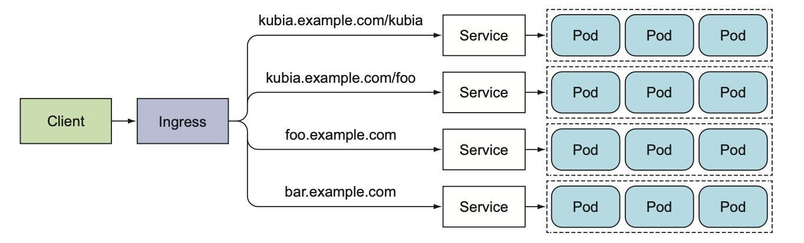

# Kubernetes

<font size="5"> Table of contents </font> \
<font size="3">1. [Architecture](#architecture)</font> \
<font size="3">2. [Pod](#pod)</font> \
<font size="3">3. [Controller](#controller)</font> \
<font size="3">4. [Services](#services)</font> \
<font size="3">5. [Volume](#volume)</font> \
<font size="3">6. [ConfigMap & Secret](#configmap--secret)</font> \
<font size="3">7. [Deployment](#deployment)</font> \
<font size="3">8. [Statefulset](#statefulset)</font> \- [Kubernetes](#kubernetes)
<font size="3">9. [Auto scaling](#auto-scaling) 

<div class="page"/>

# Architecture


Trong kubernetes cluster sẽ có 2 thành phần chính đó là: master node (còn gọi là control plane) và worker node. 

Trong master node bao gồm 4 thành phần là:

- etcd
- API server
- Controller Manager
- Scheduler

Trong worker node sẽ gồm có 3 thành phần:

- kubelet
- kube-proxy
- container runtime

Ngoài ra, k8s cũng có những add-on khác như:

- K8S Dashboard
- Ingress controller
- ...

### Etcd

- Là một database(dạng key-value) lưu trữ các metadata về các resource mà chúng ta đã tạo trên k8s. 

### API server

- Là thành phần quan trọng nhất k8s, được sử dụng bởi các thành phần khác hoặc client.
- Nó cung cấp một REST API để có thể thực hiện các hành động CRUD(create,read,update,delete) lên cluster state (là các thông tin về resource trong cluster) và lưu state vào etcd.
- API server cũng chịu trách nhiệm authentication, authorization, validation config của các resource.
- Cơ chế khi dùng kubelet để tạo resource, 
    * Đầu tiên, kubelet gửi 1 POST request kèm theo config manifest(tức là các file yaml) của resource tới API Server. 
    * API Server xác thực client này qua Authentication plugin và kiểm tra permission qua Authorization plugin.
    * Tiếp theo, nó sẽ chuyển đổi config manifest sang dạng format mà nó hiểu qua các Admission control plugin.
    * Sau đó, API server sẽ validate các config này xem có đúng hay không, nếu mọi thế đều ok thì resource này sẽ được lưu vào etcd


### Controller Manager

- Controller có nhiệm vụ lắng nghe những thay đổi về resource qua API Server và thực hiện những action tương ứng. (create, update hoặc delete).
- Mỗi controller sẽ thực hiện các công việc khác nhau. Một số controller như: Replicaset, DaemonSet, Deployment

### Scheduler

- Phụ trách việc lựa chọn worker để deploy pod.

### Kubelet

- Là một client tools, có trách nhiệm tương tác với master node và quản lý các container.

### Kube proxy

- Là thành phần quản lý traffic và network của worker node.

### Container runtime

- Là engine để chạy các container. Nổi tiếng nhất là docker, ngoài ra còn có CRI-O, containerd.

<div class="page"/>

# Pod

## Giới thiệu Pod

Pod là thành phần trong k8s, dùng để triển khai và chạy các ứng dụng(cụ thể là các container).

Có thể triển khai một hoặc nhiều container trong một pod (nhưng thông thường chỉ nên run pod với 1 container). Những containers trong cùng một pod, cùng chia sẻ network namespace → có thể truy cập với nhau qua `localhost`.

Mỗi pod được tạo ra sẽ có 1 IP(virtual IP), và các pods có thể truy cập với nhau thông qua IP này.

Ví dụ để tạo 1 pod trên k8s cluster.

- Bước 1: Ta cần 1 file pod manifest như sau (giả sử đặt tên là `kubia.yaml`):
        
    ```yaml
    # kubia.yaml
    
    apiVersion: v1
    kind: Pod
    metadata:
        name: kubia
    spec:
        containers:
            - image: luksa/kubia
                name: kubia
                ports:
                    - containerPorts: 8080
    ```

    Đây là một file manifest cơ bản để tạo pod, nó có các thuộc tính cần lưu ý:

    * apiVersion: là version của API Server tạo ra resource(ở đây là pod)

    * kind: là loại resource chúng ta muốn tạo, có thể là Pod, Replicaset, Service,...

    * metadata: chứa các thông tin như name, labels, annotations

    * spec: tuỳ vào loại resource chúng ta cần tạo, ở đây là pod sẽ chứa các thông tin liên quan đến các cấu hình cho pod như image, containers, volume, ...
        
- Tiếp theo, cần dùng câu lệnh sau để submit file pod config lên cluster và cluster sẽ khởi tạo pod có tên là `kubia`:
        
    ```bash
    $ kubectl create -f kubia.yaml

    pod/kubia created
    ```
        
- Bây giờ kiểm tra xem pod đó đã được tạo hay chưa, có bị lỗi không
        
    ```bash
    $ kubectl get pods
    NAME          READY   STATUS    RESTARTS   AGE
    kubia         1/1     Running   0          29h
    ```

    Ở trạng thái `Running`, tức là pod đã được khởi tạo và chạy thành công.
        
- Để kiểm tra log của pod `kubia`, ta sử dụng câu lệnh
    
    ```bash
    $ kubectl logs kubia

    Kubia server starting...
    ```
     
- Bây giờ cần expose port của pod ra ngoài để test, ta sử dụng câu lệnh đơn giản sau(lệnh này chỉ dùng để test, không dùng cho production)
    
    ```bash
    $ kubectl port-forward kubia 8888:8080
    
    Forwarding from 127.0.0.1:8888 -> 8080
    Forwarding from [::1]:8888 -> 8080
    ```
    
- Kiểm tra bằng curl, send request đến địa chỉ `localhost:8888`
    
    ```bash
    $ curl localhost:8888
    
    You've hit kubia
    ```
    

## Pod labels

Labels là metadata(dạng key-value) được gán vào không chỉ Pod mà còn cho các resource khác trong k8s.

Dùng pod labels để phân chia các pod khác nhau tuỳ thuộc vào dự án hoặc môi trường. Một Pod có thể có nhiều hơn 1 labels.

- Ví dụ file manifest, dùng để tạo một pod với labels
    
    ```yaml
    # kubia-label.yaml

    apiVersion: v1
    kind: Pod
    metadata:
        name: kubia-label
        labels:
            env: prod
    spec:
        containers: 
            ...
    ```
    
    Có thể thấy, điểm khác so với ví dụ trước chỉ là có thêm cặp giá trị `env:prod` ở trường `metadata.lables`.

    Submit lên cluster:

    ```bash
    $ kubectl create -f kubia-label.yaml

    pod/kubia-label created
    ```
    
- Bây giờ tạo label cho pod `kubia` (ở ví dụ trước)
    
    ```bash
    $ kubectl label pod kubia env=debug

    pod/kubia labeled
    ```
    
- Overwrite label pod `kubia-label`
    
    ```bash
    $ kubectl label pod kubia-label env=debug --overwrite

    pod/kubia-label labeled
    ```
    
- Show list pod với label selector
    
    ```bash
    $ kubectl get pod -l env=prod # show all pod có label env=prod

    $ kubectl get pod -l env # show all pod có label key là env, không quan tâm giá trị value
    
    $ kubectl get pod -l '!env' # show all pod có mà không có label key là env

    $ kubectl get pod -L env # show all pod thêm colum có label là env

    NAME    READY   STATUS    RESTARTS   AGE   ENV
    kubia   1/1     Running   0          23m   debug
    ```
    

## Pod Annotation

Giống như labels, annotation được gán cho mọi resource trong k8s.

Chỉ có tác dụng lưu trữ các thông tin metadata(author, version, created date, ...) dùng để kết nối với thirdparty tools hoặc cung cấp thông tin cho k8s administrator.

- Để annotate cho pod `kubia`, dùng command sau:
    
    ```bash
    $ kubectl annotate pod kubia com.example/k8s="annotate k8s"

    pod/kubia annotated
    ```
    

## Namespace

Như đã biết, labels dùng để phân chia các pod theo môi trường hoặc dự án nhưng chỉ ở mức định danh. Còn tài nguyên thì vẫn sử dụng chung nhau.

Do đó, namespace, là thành phần sẽ phân chia tài nguyên của các resource trong k8s một cách độc lập, giữa các môi trường hoặc dự án. Ví dụ: ta cần phải chia tài nguyên giữa các môi trường dev, production, QA.

Mặc định các resource được tạo trong namespace `default`

- Show toàn bộ namespace trong cluster
    
    ```bash
    $ kubectl get namespace
    
    # hoặc
    
    $ kubectl get ns

    NAME                   STATUS   AGE
    default                Active   47h
    kube-node-lease        Active   47h
    kube-public            Active   47h
    kube-system            Active   47h
    kubernetes-dashboard   Active   36h
    ```
    
- Show pod trong một namespace cụ thể
    
    ```bash
    $ kubectl get pod --namespace kube-system

    NAME                       READY   STATUS    RESTARTS   AGE
    coredns-55b9c7d86b-bllv6   1/1     Running   0          47h
    kube-proxy-ppf7v           1/1     Running   0          36h
    ```
    
- Tạo namespace có tên là `custom`:
    
    ```bash
    $ kubectl create namespace custom

    namespace/custom created
    ```
    
- Tạo pod trong namespace `custom`:
    
    ```bash
    $ kubectl apply -f kubia.yaml -n custom
    
    pod/kubia created
    ```
    

## Pod Deleting

- Xoá pod theo name
    
    ```bash
    $ kubectl delete pod kubia # xoá pod có tên là kubia

    pod "kubia" deleted
    ```
    
- Xoá pod bằng label
    
    ```bash
    $ kubectl delete pod -l env=debug

    pod "kubia" deleted
    ```
    
- Xoá toàn bộ pod
    
    ```bash
    $ kubectl delete pod --all

    pod "kubia" deleted
    pod "kubia-label" deleted
    ```


<div class="page"/>

# Controller

## ReplicationController(RC)

Là controller có nhiệm vụ đảm bảo đủ một số lượng pod nhất định chạy trong cluster không thừa không thiếu. Khi 1 pod bị crash → RC sẽ tạo pod mới thay thế.

Để tạo file manifest cho Replication Controller, cần lưu ý 3 thuộc tính sau: 
- label selector: xác định pod nào sẽ được RC quản lý.
- replica count: số lượng pod.
- pod template: template dùng để tạo pod mới.

Ví dụ tạo Replication Controller với 3 pod luôn available trong hệ thống.

- Đầu tiên tạo file manifest có tên `kubia-rc.yaml`
    
    ```yaml
    # kubia-rc.yaml
    
    apiVersion: v1
    kind: ReplicationController
    metadata:
    	name: kubia-rc
    spec:
    	replicas: 3
    	selector: 
    		app: kubia
    	template:
    		metadata:
    			labels: 
    				app: kubia
    			spec:
    				containers:
    					- name: kubia
    						image: luksa/kubia
    						ports:
    							- containerPort: 8080
    ```
    
- Submit file manifest lên cluster
    
    ```bash
    $ kubectl create -f kubia-rc.yaml

    replicationcontroller/kubia-rc created
    ```

- Kiểm tra replication controller đã chắc chắn được khởi tạo hay chưa bằng câu lệnh

    ```bash
    $ kubectl get rc

    NAME       DESIRED   CURRENT   READY   AGE
    kubia-rc   3         3         3       63s
    ```
- Kiểm tra xem có đúng 3 pod đã được khởi tạo hay chưa.

    ```bash
    $ kubectl get pods

    NAME             READY   STATUS    RESTARTS   AGE
    kubia-rc-4tkzl   1/1     Running   0          2m28s
    kubia-rc-5vbrl   1/1     Running   0          2m29s
    kubia-rc-z79cs   1/1     Running   0          2m28s
    ```

- Thực hiện xoá 1 pod, để xem RC sẽ xử lý như nào

    - Đầu tiên xoá 1 pod
        ```
        $ kubectl delete pod kubia-rc-4tkzl

        pod "kubia-rc-4tkzl" deleted
        ```
    - kiểm tra pods

        ```bash
        $ kubectl get pods

        NAME             READY   STATUS        RESTARTS   AGE
        kubia-rc-4tkzl   1/1     Terminating   0          4m28s
        kubia-rc-5vbrl   1/1     Running       0          4m28s
        kubia-rc-z79cs   1/1     Running       0          4m28s
        kubia-rc-12yt8   1/1     Running       0          9s
        ```

        Ta thấy 1 pod mới `kubia-rc-12yt8` được khởi tạo để thay thế pod `kubia-rc-4tkzl` vừa bị xoá. RC `kubia-rc` tạo pod này và quản lý nó để đảm bảo hệ thống luôn có 3 pods.

- Để scale up/down sô pod, có thể dùng command:
    
    ```bash
    $ kubectl scale rc kubia-rc --replicas=10 # scale up
    replicationcontroller/kubia-rc scaled

    $ kubectl scale rc kubia-rc --replicas=2 # scale down
    replicationcontroller/kubia-rc scaled
    ```
    
- Xoá replication controller
    
    ```bash
    $ kubectl delete rc kubia-rc # xoá controller và xoá luôn pod
    replicationcontroller "kubia-rc" deleted
    
    $ kubectl delete rc kubia-rc --cascade=orphan # xoá controller không xoá pods
    replicationcontroller "kubia-rc" deleted
    ```
    

## Replicaset(RS)

Replicaset là bản nâng cấp của ReplicationController, đó là được tối ưu hơn ở phần label selector.

So với RC, trong phần label selector của RS, có thể dùng các điều kiện và expression nâng cao hơn để select nhiều pod hơn. 

Ví dụ để tạo Replicaset trên k8s

- Đầu tiên, tạo file manifest `kubia-replicaset.yaml`:
    
    ```yaml
    # kubia-replicaset.yaml
    
    apiVersion: apps/v1
    kind: ReplicaSet
    metadata:
      name: kubia-replicaset
    spec:
      replicas: 3
      selector:
        matchExpressions:
          - key: app
            operator: In
            values:
              - kubia-rs
      template:
        ...
    ```
    
- Submit file lên cluster
    
    ```bash
    $ kubectl create -f kubia-replicaset.yaml 

    replicaset.apps/kubia-replicaset created
    ```

- Kiểm tra replicaset đã được khởi tạo hay chưa

    ```bash
    $ kubectl get rs

    NAME               DESIRED   CURRENT   READY   AGE
    kubia-replicaset   3         3         3       61s
    ```

- Kiểm tra số pods

    ```bash
    $ kubectl get pods

    NAME                     READY   STATUS    RESTARTS   AGE
    kubia-replicaset-2xn6r   1/1     Running   0          100s
    kubia-replicaset-cc4sw   1/1     Running   0          100s
    kubia-replicaset-jjwnl   1/1     Running   0          100s
    ```

- Xoá Replicaset
    
    ```bash
    $ kubectl delete rs kubia-replicaset # xoá replicaset và xoá luôn pod
    replicaset.apps "kubia-replicaset" deleted
    
    $ kubectl delete rc kubia-rc --cascade=orphan # xoá replicaset không xoá pods
    replicaset.apps "kubia-replicaset" deleted
    ```
    

## DaemonSet(DS)


Là controller có nhiệm vụ đảm bảo chỉ có duy nhất một pod được deploy trên mỗi worker node. Khi có 1 worker node được thêm vào cluster, daemonset sẽ tự động deploy pod lên worker node này. DS phù hợp với các ứng dụng log collector hoặc monitor worker node.

Ví dụ tạo Daemonset trên k8s

- Tạo file manifest `daemonset.yaml`:
    
    ```yaml
    # daemonset.yaml
    
    apiVersion: apps/v1
    kind: DaemonSet
    metadata:
      name: ssd-monitor
    spec:
      selector:
        matchLabels:
          app: ssd-monitor
      template:
        metadata:
          labels:
            app: ssd-monitor
        spec:
          containers:
            - image: luksa/ssd-monitor
              name: main
    ```
    
- Submit file lên cluster
    

    ```bash
    $ kubectl create -f daemonset.yaml

    daemonset.apps/ssd-monitor created
    ```

 - Kiểm tra Daemonset

    ```bash
    $ kubectl get ds

    NAME          DESIRED   CURRENT   READY   UP-TO-DATE   AVAILABLE
    ssd-monitor   1         1         1       1            1
    ```

- Kiểm tra số pods

    ```
    $ kubectl get pods

    NAME                READY   STATUS    RESTARTS   AGE
    ssd-monitor-sf48d   1/1     Running   0          2m28s
    ```

- Sau khi cho thêm 1 worker node join vào cluster, ta kiểm tra

    ```bash
    $ kubectl get ds
    NAME          DESIRED   CURRENT   READY   UP-TO-DATE   AVAILABLE
    ssd-monitor   2         2         2       2            2

    $ kubectl get pods
    NAME                READY   STATUS    RESTARTS   AGE
    ssd-monitor-kkkvr   1/1     Running   0          72s
    ssd-monitor-sf48d   1/1     Running   0          8m6s
    ```
    
    Như ta đã thấy, khi thêm 1 node mới, DS sẽ tự động deploy pod cho node mới này.

- Xoá daemonset

    ```bash
    $ kubectl delete ds ssd-monitor

    daemonset.apps "ssd-monitor" deleted
    ```

## Job Controller(job)

Ngoài Replicaset, DaemonSet, là những controller hỗ trợ chạy những continous tasks. K8S còn hỗ trợ để chạy những completable tasks qua Job Controller. (job controller phù hợp với những ad-hoc task, initial jobs).

Ví dụ tạo Job controller

- Tạo file manifest `jobs.yaml`
    
    ```yaml
    # jobs.yaml
    
    apiVersion: batch/v1
    kind: Job
    metadata:
      name: batch-job
    spec:
      template:
        metadata:
          labels:
            app: batch-job
        spec:
          restartPolicy: OnFailure
          containers:
            - name: main
              image: luksa/batch-job
    ```

- Submit lên cluster
    
    ```
    $ kubectl create -f jobs.yaml
    job.batch/batch-job created
    ```

- Kiểm tra jobs controller và pods

    ```
    $ kubectl get jobs

    NAME        COMPLETIONS   DURATION   AGE
    batch-job   0/1           30s        30s

    $ kubectl get pods
    NAME              READY   STATUS    RESTARTS   AGE
    batch-job-w9bl9   1/1     Running   0          84s

    # lúc này job chưa chạy xong, vẫn đang ở trạng thái running
    # Sau 2 phút, kiểm tra lại

    $ kubectl get jobs
    NAME        COMPLETIONS   DURATION   AGE
    batch-job   1/1           2m6s       2m42s

    $ kubectl get pods
    NAME              READY   STATUS      RESTARTS   AGE
    batch-job-w9bl9   0/1     Completed   0          3m21s

    # jobs đã completed.
    ```


## CronJob Controller

Kubernetes cũng hỗ trợ schedule task qua Cronjob Controller. Áp dụng những rule giống như cronjob trên linux.

Ví dụ tạo Cronjob controller

- Tạo file manifest `cronjobs.yaml`
    
    ```yaml
    # cronjobs.yaml
    
    apiVersion: batch/v1
    kind: CronJob
    metadata:
      name: schedule-job
    spec:
      schedule: "0,1,2,3 * * * *"
      jobTemplate:
        spec:
          template:
            metadata:
              labels:
                app: schedule-job
            spec:
              restartPolicy: OnFailure
              containers:
                - name: main
                  image: luksa/batch-job
    ```
- Submit file lên cluster

    ```bash
    $ kubectl create -f cronjobs.yaml

    cronjob.batch/schedule-job created
    ```

- Kiểm tra cronjobs và pod

    ```bash
    # kiểm tra cronjobs
    $ kubectl get cj 

    NAME           SCHEDULE          SUSPEND   ACTIVE   LAST SCHEDULE   AGE
    schedule-job   0,1,2,3 * * * *   False     1        22s             7m3s


    # kiểm tra pods
    $ kubectl get pods

    NAME                          READY   STATUS    RESTARTS   AGE
    schedule-job-27451740-6tlv7   1/1     Running   0          66s
    schedule-job-27451741-d842x   1/1     Running   0          6s
    ```

- Xoá cronjob controller

    ```bash
    $ kubectl delete cj schedule-job
    ```

<div class="page"/>

# Services

Service cũng là một resource trong kubernetes, nó tạo ra 1 endpoint cho nhóm các pod phía sau.

Mỗi service sẽ có một IP address và port không đổi, chỉ trừ khi nó bị xoá đi và tạo lại.

Client muốn connect đến pod, thay vì connect trực tiếp đến pod, client mở connect tới service, rồi service sẽ dẫn connect đó đến một trong các Pod phía sau. 

Ngoài ra, service còn giúp các pod trong cùng cluster có thể dễ dàng giao tiếp với nhau.


Một câu hỏi được đặt ra là: các pod khi tạo đều có IP, tại sao không sử dụng các IP này để connect mà lại cần dùng service? Có 2 lý do chính sau:
- Thứ nhất, các pod chạy bình thường thì sẽ không có vấn đề gì, tuy nhiên trong trường hợp pod bị crash cần tạo lại → pod mới sẽ sinh ra IP mới → nên sẽ phải update lại cấu hình trong code.
- Thứ hai, trường hợp có 3 pod cùng serving. Vậy client sẽ biết gửi request đến pod nào? → thì service sẽ xử lý cho chúng ta bằng cách tạo 1 endpoint không đổi cho nhóm các pod này, client chỉ cần tương tác với endpoint này là có thể giải quyết được vấn đề.

Trong kubernetest, có 4 loại service cơ bản:
- ClusterIP
- NodePort
- LoadBalancer
- Ingress

## ClusterIP

Là loại service sẽ tạo một IP address và local DNS để các pod giao tiếp bên trong với nhau, từ bên ngoài không thể access vào được. Được dùng chủ yếu để các pod bên trong cluster giao tiếp dễ dàng với nhau.

Ví dụ tạo service cho group pod

- Đầu tiên, tạo 3 pod có label `app:kubia` ta sử dụng replicaset manifest `kubia-rs.yaml`

    ```yaml
    # kubia-rs.yaml

    apiVersion: apps/v1
    kind: ReplicaSet
    metadata:
    	name: kubia-rs
    spec:
    	replicas: 2
    	selector: 
    		app: kubia
    	template:
    		metadata:
    			labels: 
    				app: kubia
    			spec:
    				containers:
    					- name: kubia
    						image: luksa/kubia
    						ports:
    							- containerPort: 8080
    ```

- Tiếp theo, tạo service cho group 3 pod có label `app:kubia` này.
    
    ```yaml
    # service.yaml
    
    apiVersion: v1
    kind: Service
    metadata:
      name: kubia
    spec:
      ports: 
        - port: 80 # là port của Service
          targetPort: 8080 # là port mà các pod serving
      selector:
        app: kubia
    ```

- Submit file manifest lên cluster

    ```bash
    # tạo replicaset
    $ kubectl create -f kubia-rs.yaml
    replicaset.apps/kubia-rs created
    
    # tạo service
    $ kubectl create -f service.yaml
    service/kubia created

- Kiểm tra service và pods

    ```bash
    # kiểm tra service
    $ kubectl get svc
    NAME         TYPE        CLUSTER-IP      EXTERNAL-IP   PORT(S)   AGE
    kubia        ClusterIP   10.100.65.255   <none>        80/TCP    38s  

    # kiểm tra pod
    $ kubectl get pods
    NAME             READY   STATUS    RESTARTS   AGE
    kubia-rs-jpchf   1/1     Running   0          2m5s
    kubia-rs-q4hv7   1/1     Running   0          2m5s
    kubia-rs-zvr9n   1/1     Running   0          2m5s
    ```
    
- Để test service, ta có thể send request từ pod `kubia-rs-jpchf` đến service `kubia` bằng câu lệnh
    
    ```bash
    # dùng IP của service
    $ kubectl exec kubia-rs-jpchf -- curl -s http://10.100.65.255
    You have hit kubia-rs-zvr9n
    
    # hoặc dùng dns name(theo format <service_name>.default)
    $ kubectl exec kubia-rs-jpchf -- curl -s http://kubia.default
    You have hit kubia-rs-zvr9n
    ```

    Trong ví dụ này, ta sử dụng ngay pod của service để test. Tuy nhiên, trong  thực tế có thể là 1 pod của service khác.
    

## NodePort


Loại service tiếp theo, là NodePort, là một cách expose pod để client có thể connect từ bên ngoài vào.

Tương tự như ClusterIP Service, NodePort cũng tạo ra endpoint để các pod trong cluster giao tiếp với nhau, đồng thời nó sẽ mở một port trên các worker node đang chạy các pod. Lúc này, client sẽ có thể connect vào pod qua `<ip_worker_node>:<port>`
*Lưu ý*: range cho nodeport từ 30000-32767

Ví dụ tạo NodePort cho các pod có label `app:kubia` (đã tạo phía trên)

- Tạo nodeport manifest `nodeport.yaml`
    
    ```yaml
    # nodeport.yaml

    apiVersion: v1
    kind: Service
    metadata:
      name: kubia-nodeport
    spec:
      type: NodePort
      ports:
        - port: 80 # port của Service
          nodePort: 30123 # node port
          targetPort: 8080 # port của các pod
      selector:
        app: kubia
    ```

- Submit manifest lên cluster

    ```bash
    $ kubectl create -f nodeport.yaml

    service/kubia-nodeport created
    ```

- Kiểm tra nodeport

    ```bash
    $ kubectl get svc

    NAME             TYPE        CLUSTER-IP      EXTERNAL-IP   PORT(S)        AGE
    ...
    kubia-nodeport   NodePort    10.100.54.226   <none>        80:30123/TCP   5s
    ```

- Test request nodeport service cho các pod trong cluster

    ```bash
    $ kubectl exec kubia-rs-jpchf -- curl -s http://kubia-nodeport.default
    You have hit kubia-rs-zvr9n
    ```

- Test request nodeport service cho client từ bên ngoài. (Giả sử IP của worker node là `53.44.13.172`

    ```bash
    $ curl -s http://53.44.13.172:30123
    kubia-rs-jpchf
    ```
    
## LoadBalancer

Là service mở rộng từ nodeport, cũng tương tự như cách nodeport hoạt động. Chỉ khác là nó tạo ra 1 endpoint để client truy cập vào pod từ endpoint này thay vì truy cập bằng IP của worker node.

*Lưu ý:* Loại service này chỉ hỗ trợ cho k8s trên cloud, với môi trường không hỗ trợ thì sẽ không thể cài được.


Ví dụ tạo Loadbalancer cho các pod có label `app:kubia`

- Tạo loadbalancer manifest    
    
    ```yaml
    # loadbalancer.yaml

    apiVersion: v1
    kind: Service
    metadata:
      name: kubia-nodeport
    spec:
      type: LoadBalancer
      ports:
        - port: 80 # loadbalancer port
          targetPort: 8080 # port của các pod
      selector:
        app: kubia
    ```

- Submit file manifest lên cluster

    ```
    $ kubectl create -f loadbalancer.yaml

    service/kubia-loadbalancer created
    ```

- Kiểm tra loadbalancer resource

    ```
    $ kubectl get svc
    
    NAME                TYPE            CLUSTER-IP      EXTERNAL-IP     PORT(S)        AGE
    ...
    kubia-loadbalancer  LoadBalancer    10.100.54.226   54.13.223.144   80:30713/TCP   5s
    ```

    EXTERNAL-IP là IP của loadbalancer
    CLUSTER-IP là IP trong cluster hoặc có thể dùng DNS
    PORT(S) 80:30713, trong đó, service port là 80, nodeport là 30713

- Test request loadbalancer service

    ```bash
    $ curl http://54.13.223.144
    You have hit kubia-rs-q4hv7
    ```

## Ingress

Nếu mỗi service muốn expose ra bên ngoài cho client mà sử dụng LoadBalancer thì sẽ cần 1 public ip → nhiều service cần nhiều public IP → tốn chi phí cho IP.

Do đó, Ingress được sinh ra để giải quyết vấn đề này. Thay vì cần nhiều IP cho các service, Ingress sẽ giống như một smart router, đứng trước các service và route traffic đến các service tương ứng.

Có nhiều loại Ingress khác nhau, ngoài ra còn có các plugin dành cho các Ingress này.



Ví dụ các tạo ingress manifest

```yaml
apiVersion: networking.k8s.io/v1
kind: Ingress
metadata:
    name: kubia-ingress
spec:
    rules:
    - host: kubia.example.com
        http:
        paths:
            - path: /
            pathType: Prefix
            backend: 
                service: 
                name: kubia
                port: 
                    number: 80
```

<div class="page"/>

# Volume

Volume hiểu đơn giản là mount point từ một hệ thống file server vào trong container.

Volume không phải là 1 resource của K8S nên không thể tạo và xoá như resource độc lập khác mà volume được define và khởi tạo trong file pod manifest.

Có nhiều loại volume khác nhau, mỗi loại có 1 công dụng riêng không giống nhau.

## emptyDir

Là loại volume đơn giản nhất dùng để share data giữa các container trong cùng một pod.

Volume này chỉ tồn tại trong lifecycle của pod, khi pod bị xoá → volume cũng bị mất.

- Tạo pod với emptyDir volume
    
    ```yaml
    # emptyDir-volume.yaml

    apiVersion: v1
    kind: Pod
    metadata:
        name: fortune
    spec:
        containers:
        - image: luksa/fortune
            name: html-generator
            volumeMounts:
            - name: html
                mountPath: /var/htdocs
        - image: nginx:alpine
            name: web-server
            volumeMounts:
            - name: html
                mountPath: /usr/share/nginx/html
                readOnly: true
            ports:
            - containerPort: 80
        volumes:
        - name: html
            emptyDir: {}
    ```
    
    Ở đây, ta có 2 container(`html-generator` tự động tạo file html, `web-server` serving file html) và 1 emptyDir volume là html, volume này được mount vào container `html-generator` ở folder `/var/htdocs`, đồng thời nó cũng được mount vào container `web-server` ở folder `/usr/share/nginx/html`. Do đó, khi `html-generator` tạo file html thì bên trong `web-server` sẽ nhìn thấy file này và serving cho client.
    

## gitRepo & hostPath

gitRepo: là loại volume giống emptyDir, nó sẽ tạo ra một empty folder trong pod và clone code trên git về repo này.

hostPath: Là loại volume moun mount từ pod ra ngoài file system của worker node. Dữ liệu trong volume này chỉ tồn tại trên worker node. Tuy nhiên, data sẽ bị mất nếu pod được deploy ở một node khác.

- Tạo pod với gitRepo & hostPath volume

  ```yaml
  apiVersion: v1
  kind: Pod
  metadata:
    name: hostpath-volume
  spec:
    containers:
      - image: nginx:alpine
        name: web-server
        volumeMounts:
          - name: html
            mountPath: /usr/share/nginx/html
            readOnly: true
          - name: log # log volume
            mountPath: /var/log/nginx # mounted at /var/log/nginx in the container
        ports:
          - containerPort: 80
            protocol: TCP
    volumes:
      - name: html
        gitRepo: # gitRepo volume
          repository: https://github.com/luksa/kubia-website-example.git # The volume will clone this Git repository
          revision: master # master branch
          directory: . # cloned into the root dir of the volume.
      - name: log
        hostPath: # hostPath volume
          path: /var/log # folder of woker node
  ```

## Cloud Storage

Đây là loại volume để lưu trữ persistent data, dữ liệu vẫn tồn tại cho các container kể cả khi pod đã bị xoá. Loại volume này chỉ hỗ trợ trên các nền tảng cloud (aws, azure, gcp, ...). Ứng với mỗi cloud platform sẽ có những property khác nhau (aws có awsElasticBlockStore, azure có azureDisk, ...)

- Ví dụ tạo pod với aws volume:
    
    ```yaml
    apiVersion: v1
    kind: Pod
    metadata:
      name: mongodb
    spec:
      containers:
        - image: mongo
          name: mongodb
          volumeMounts:
            - name: mongodb-data
              mountPath: /data/db
          ports:
            - containerPort: 27017
      volumes:
        - name: mongodb-data
          awsElasticBlockStore: 
            volumeID: vol-xxx
            fsType: ext4
    ```
    

## PersistentVolumes & PersistentVolumeClaims

Do không phải ai cũng biết các kiến trúc lưu trữ bên dưới của worker node nên Kubernetes cung cấp cho chúng ta 2 resource dùng để tách kiến trúc lưu trữ này khi khởi tạo pod. Tức là tạo pod mà không cần quan tâm sẽ sử dụng công nghệ gì để lưu trữ.
- PersistentVolumes(PV) là resource sẽ tương tác với kiến trúc lưu trữ.
- PersistentVolumeClaims(PVC) sẽ request storage từ PersistentVolumes.

Thông thường trên một hệ thống k8s cluster sẽ có 2 role là:
- Administrator: là người triển khai và quản lý k8s, cài những add-on cần thiết, sẽ là người quyết định công nghệ lưu trữ.
- Developer: là những người viết file config yaml để deploy application lên cluster, tức là những người sử dụng không cần quan tâm đến công nghệ lưu trữ phía sau.

Một kubernetes administrator sẽ là người setup kiến trúc storage bên dưới và tạo các PersistentVolumes để cho kuberetes developer request và sử dụng.


Các bước để khởi tạo PV và PVC

- Bước 1: Administrator khởi tạo PersistentVolume `mongodb-pv` với capacity là 10GB trên cluster:
        
  ```yaml
  # persistent-volume.yaml

  apiVersion: v1
  kind: PersistentVolume
  metadata:
    name: mongodb-pv
  spec:
    capacity:
      storage: 10Gi
    accessModes:
      - ReadWriteOnce
      - ReadOnlyMany
    persistentVolumeReclaimPolicy: Retain
    awsElasticBlockStore: 
      volumeID: vol-0d4d4ef91a4fd03ae
      fsType: ext4
  ```
        
    Ở đây Administrator cần phải chỉ định size cho PV và các access mode cho nó. Ngoài ra còn sử dụng loại công nghệ lưu trữ là gì cloud hay on-premise.
        
- Bước 2: Developer khởi tạo PersistentVolumeClaims `mongo-pvc` để tiêu thụ PersistentVolume.
        
  ```yaml
  # persistent-volume-claims.yaml

  apiVersion: v1
  kind: PersistentVolumeClaim
  metadata:
    name: mongo-pvc
  spec:
    resources:
      requests:
        storage: 10Gi
    accessModes:
      - ReadWriteOnce
    storageClassName: ""
  ```
        
  Ở đây, developer tạo 1 PVC có capacity là 10GB storage, nếu có PV nào đáp ứng được yêu cầu này thì PVC được bind vào PV đó.
        
- Bước 3: Tạo resource
  ```bash
  # tạo persistent volume
  $ kubectl create -f persistent-volume.yaml
  persistentvolume/mongodb-pv created

  # tạo persistent volume claims
  $ kubectl create -f persistent-volume-claims.yaml
  persistentvolumeclaim/mongo-pvc created
  ```

- Bước 4: Kiểm tra xem các resource đã được tạo hay chưa.
    
  ```bash
  $ kubectl get pvc
  NAME        STATUS   VOLUME       CAPACITY   ACCESS MODES   STORAGECLASS   AGE
  mongo-pvc   Bound    mongodb-pv   10Gi       RWO,ROX                       112s

  
  $ kubectl get pv
  NAME         CAPACITY   ACCESS MODES   RECLAIM POLICY   STATUS   CLAIM               STORAGECLASS   REASON   AGE
  mongodb-pv   10Gi       RWO,ROX        Retain           Bound    default/mongo-pvc                           3m21s

  # pvc đã được bind vào pv(ở colume CLAIM)
  ```
        
- Bước 5: Tiếp theo Developer sẽ tạo pod mà sử dụng PVC
    
    ```yaml
    # mongodb-pod.yaml

    apiVersion: v1
    kind: Pod
    metadata:
      name: mongodb
    spec:
      containers:
        - image: mongo
          name: mongodb
          volumeMounts:
            - name: mongodb-data
              mountPath: /data/db
          ports:
            - containerPort: 27017
      volumes:
        - name: mongodb-data
          persistentVolumeClaim:
            claimName: mongodb-pvc
    ```

    Tạo pod
    ```
    $ kubectl create -f mongodb-pod.yaml
    ```
        

### Recycling PersistentVolume

Khi tạo PersistentVolume(PV), Administrator sử dụng thuộc tính persistentVolumeReclaimPolicy, có 3 giá trị là retain, recycle và delete.
Trong đó:
- retain: tức là khi xoá PVC, thì PV vẫn còn nhưng ở trạng thái Release(tức là đã có dữ liệu) → nếu có một PVC khác bind vào sẽ gây ra lỗi.
- recycle: khi xoá PVC, PV vẫn tồn tại, nhưng lúc này data trong PV cũng bị xoá đi luôn → PVC mới có thể bind vào.
- delete: khi xoá PVC thì xoá luôn PV.

### Dynamic Provisioning PersistentVolume

Khi tạo và sử dụng PersistentVolume, Administrator vẫn cần phải tạo PV thủ công xong thì Developer mới sử dụng được. 

Tuy nhiên k8s có hỗ trợ cách để tạo PV một cách tự động. Đó là sử dụng StorageClass với một provisioner (được hỗ trợ mặc định khi sử dụng k8s trên cloud, còn các môi trường khác phải tự cài các provisioner này).


Ví dụ StorageClass với AWS provisioner

  - Tạo StorageClass (có tên là `fast`):

    ```yaml
    # storageclass.yaml

    apiVersion: storage.k8s.io/v1
    kind: StorageClass
    metadata:
      name: fast
    provisioner: kubernetes.io/aws-ebs
    parameters:
      type: gp2
      fsType: ext4
    ```
    
- Tiếp theo, tạo PVC sử dụng storage class này
    
    ```yaml
    # pvc.yaml

    apiVersion: v1
    kind: PersistentVolumeClaim
    metadata:
      name: mongo-pvc
    spec:
      resources:
        requests:
          storage: 10Gi
      accessModes:
        - ReadWriteOnce
      storageClassName: fast
    ```

- Tạo các resource
  
  ```bash
  $ kubectl create -f storageclass.yaml
  storageclass.storage.k8s.io/fast created

  $ kubectl create -f pvc.yaml
  persistentvolumeclaim/mongo-pvc created
  ```

  Để kiểm tra, ta lên AWS Console → EC2 → EBS sẽ thấy có 1 volume được tạo mới, chính là PersistentVolume mà provisioner đã tự động khởi tạo cho chúng ta.


<div class="page"/>

# ConfigMap & Secret

Hầu hết các ứng dụng của chúng ta cần config để chạy (ví dụ như config cho database, config port, ... )

Trong k8s, để truyền các config vào container trong pod, ta có thể truyền chúng qua:
- Biến môi trường(env)
- K8S configmap

## env

k8s cung cấp cách để truyền các config vào trong container bằng cách thêm qua biến môi trường `env` khi khởi tạo pod.

Ví dụ file pod manifest, ở đây ta cần truyền biến `INTERVAL` vào trong container bằng cách thêm vào field `spec.containers.env`
    
```yaml
apiVersion: v1
kind: Pod
spec:
    containers:
        - image: luksa/fortune:env
          name: html-generator
          env:
            - name: INTERVAL
              value: "30"
```
    
Nhược điểm của phương pháp này:
- env không thể update trong container khi container đã chạy, muốn update phải xoá pod và chạy lại.
- khi số lượng pod lớn → config sẽ bị lặp lại hoặc file manifest tạo sẽ trở nên dài hơn nếu pod sử dụng nhiều config.

## ConfigMap

Đây là loại resource giúp ta tách các configuration của container khi khởi tạo pod. Tức là không cần phải hardcode ở thêm `specs.containers.env` khi tạo file pod manifest. Thay vào đó, ta chỉ việc khai báo sử dụng configmap này trong pod manifest mà thôi.

ConfigMap là dạng key-value. Khi sử dụng, chúng ta khai báo key ở trong file pod manifest, value sẽ tự động được truyền vào trong container như một biến env.

Ưu điểm của phương pháp này là các config được tập trung ở một chỗ và có thể sử dụng lại nhiều lần ở những pod khác nhau.

Ví dụ cách để tạo ConfigMap

- Cách đơn giản nhất là dùng cli
    
    ```bash
    $ kubectl create configmap mongodb-config \
            --from-literal=DATABASE=mongodb \
            --from-literal=ROOT_USER=mongodb \
            --from-literal=ROOT_PASSWORD=123456
    ```
        
- Hoặc dùng file config
    
    ```yaml
    # configmap.yaml

    apiVersion: v1
    kind: ConfigMap
    metadata:
        name: mongodb-config
    data:
        DATABASE: mongodb
        ROOT_USER: mongodb
        ROOT_PASSWORD: "123456"
    ```

    ```bash
    $ kubectl create -f configmap.yaml
    configmap/mongodb created
    ```

- Kiểm tra configmap

    ```bash
    $ kubectl get cm
    NAME               DATA   AGE
    mongodb            3      21m

    $ kubectl describe cm mongodb
    Name:         mongodb
    Namespace:    default
    Labels:       <none>
    Annotations:  <none>

    Data
    ====
    DATABASE:
    ----
    mongodb
    ROOT_PASSWORD:
    ----
    123456
    ROOT_USER:
    ----
    mongodb

    BinaryData
    ====

    Events:  <none>
    ```
        
        
- Sử dụng configmap trong pod
    
    - truyền từng entry trong configmap
        
        ```yaml
        apiVersion: v1
        kind: Pod
        metadata:
            name: mongodb
        spec:
            containers:
                - image: mongodb
                  name: mongodb
                  env:
                    - name: MONGO_INITDB_DATABASE
                      valueFrom:
                        configMapKeyRef:
                            name: mongodb-config
                            key: DATABASE
                    - name: MONGO_INITDB_ROOT_USERNAME
                      valueFrom:
                        configMapKeyRef:
                            name: mongodb-config
                            key: ROOT_USER
                    - name: MONGO_INITDB_ROOT_PASSWORD
                      valueFrom:
                        configMapKeyRef:
                            name: mongodb-config
                            key: ROOT_PASSWORD
        ```
        
    - hoặc truyền nhiều entry một lúc
        
        ```yaml
        apiVersion: v1
        kind: Pod
        metadata:
        	name: mongo-db
        spec:
        	containers:
        		- image: mongodb
        		  name: mongodb
        		  envFrom:
        			- prefix: MONGO_INITDB_
        			  configMapKeyRef:
        				name: mongodb-config
        ```
        

## Configmap với file config

Ngoài việc sử dụng configmap để truyền value dạng text vào pod, thì configmap còn hỗ trợ truyền value ở dạng file config.

Ví dụ về configmap với file config

- Ta có 1 file nginx config `nginx.conf`

    ```
    # nginx.conf
    
    server {
        listen  80;
        server_name _;
        gzip on;
        gzip_types text/plain application/xml;
    
        location / {
            root /usr/share/nginx/html;
            index index.html index.htm;
        }
    }
    ```
        
- Tiêp theo, tạo configmap với file config này. Trong đó, key sẽ là tên file và value sẽ là content của file config
        
    ```
    $ kubectl create configmap nginx-config --from-file nginx.conf
    ```

- Kiểm tra configmap đã được tạo hay chưa

    ```bash
    $ kubectl describe cm nginx-config

    Name:         nginx-config
    Namespace:    default
    Labels:       <none>
    Annotations:  <none>

    Data
    ====
    nginx.conf:
    ----
    server {
    listen  80;
    server_name _;
    gzip on;
    gzip_types text/plain application/xml;

    location / {
        root /usr/share/nginx/html;
        index index.html index.htm;
    }
    }

    BinaryData
    ====

    Events:  <none>

    ```
        
- Tiếp theo tạo 1 pod sử dụng configmap `nginx-config` chúng ta vừa tạo:
        
    ```yaml
    apiVersion: v1
    kind: Pod
    metadata:
        name: nginx-pod
    spec:
        containers:
        - image: nginx:alpine
            name: web-server
            ports:
                - containerPort: 80
            volumeMounts:
                - name: config
                  mountPath: /etc/nginx/conf.d
                  readOnly: true
        volumes:
            - name: config
              configMap:
                name: nginx-config
                defaultMode: "6600"
    ```
        
    Ở đây, configmap được sử dụng như một volume. Lúc này volume sẽ có 1 file tên là `nginx.conf` , sau đó được mount vào folder `/etc/nginx/config` trong container.
        

## Secret

Tương tự như ConfigMap, Secret cũng dùng để lưu trữ config nhưng ở dạng sensitive data. Và không phải ai cũng quyền read Secret.

- Ví dụ tạo secret 
    
    ```bash
    $ kubectl create secret generic mongodb-config \
                    --from-literal DATABASE=mongodb \
                    --from-literal ROOT_USER=mongodb \
                    --from-literal ROOT_PASSWORD=123456
    
    secret/mongodb-config created
    ```

- Kiểm tra secret vừa tạo

    ```bash
    # show list secret
    $ kubectl get secret
    NAME                  TYPE                                  DATA   AGE
    mongodb-config        Opaque                                3      43s

    # describe secret mongodb-config
    $ kubectl describe secret mongodb-config
    Name:         mongodb-config
    Namespace:    default
    Labels:       <none>
    Annotations:  <none>

    Type:  Opaque

    Data
    ====
    DATABASE:       7 bytes
    ROOT_PASSWORD:  6 bytes
    ROOT_USER:      7 bytes
    ```
    
- Cách sử dụng trong pod tương tự như configmap
    
    ```yaml
    apiVersion: v1
    kind: Pod
    metadata:
        name: mongo-db
    spec:
        containers:
            - image: mongodb
              name: mongodb
              envFrom:
                - prefix: MONGO_INITDB_
                  secretRef:
                    name: mongodb-config
    ```

<div class="page"/>

# Deployment

Deployment là 1 controller resource trong k8s, nó là thành phần giúp chúng ta update apps trên cluster và hiểu được tính năng zero downtime của k8s.

1. Cập nhật app trong pod

    Bắt đầu với ví dụ chúng ta có một app đang chạy trên k8s cluster. App này được deploy bằng Replicaset với số `replicas` là 3 và một Service expose traffic cho client bên ngoài access vào trong pod.

    Sau khi dev team hoàn thành một tính năng mới, chúng ta cần build lại image mới và update lại image của các Pod đang chạy. Có 2 cách để thực hiện việc này, đó là:
        - Xoá toàn bộ các pod cũ, sau đó deploy pod mới với image mới. (Recreate)
        - Deploy pod mới xong xoá mới pod cũ.(Rolling Update)

    1.1 Recreate

    Đối với cách deploy này, chúng ta có thể thực hiện cập nhật lại Pod template bằng cách sửa Replicaset. Sau đó toàn bộ pod cũ sẽ bị xoá, Replicaset sẽ tạo pull image mới về và chạy pod mới.

    

    Tuy nhiên, cách này có nhược điểm đó là sẽ có downtime trong quá trình deploy và client không thể sử dụng app. 

    1.2 RollingUpdate
    
    Nếu bạn không chấp nhận downtime trong quá trình deploy, đây là cách giải quyết

    a. Deploy pod mới, xong xoá toàn bộ pod cũ

    Với kịch bản này, chúng ta cần 2 hệ thống phần cứng để chạy song song trong quá trình deploy. Khi pod mới được deploy thành công, ta mới xoá các pod cũ.

    Chiến lược này được gọi là blue-green deployment. Có 2 phần cứng để chạy 2 môi trường production. 
    - Client sẽ sử dụng môi trường (gọi là blue)
    - Phiên bản mới được deploy (gọi là green)
    - Sau khi deploy thành công, client sẽ được route qua môi trường green.

    b. Thay thế từng pod(RollingUpdate)

    Kịch bản này các pod cũ sẽ được thay thế dần dần với các pod mới, quá trình này lặp lại đến khi các pod cũ được thay thế hết. Lúc này Service sẽ route request đến cả pod cũ và mới.
     
    Với cách này, hệ thống sẽ không có downtime trong quá trình deploy nhưng lại tốn thêm tài nguyên cho bản deploy mới.

2. Deployment Controller

    Deployment là một resource trong k8s dùng để deploy và update ứng dụng một cách dễ dàng. Deployment cung cấp cả 2 chiến lược update Recreate và RollingUpdate (như đã nói ở trên). Sẽ có history cho các bản cập nhật, do đó ta có thể dễ dàng rollout hoặc rollback một version bất của ứng dụng.

    Deployment là một high level resource, bởi vì khi tạo Deployment về bản chất nó sẽ tạo một Replicaset bên dưới, Replicaset này sẽ tạo và quản lý các pod.

    2.1 Create deployment
    
    Ví dụ về file manifest

    ```yaml
    # deployment.yaml

    apiVersion: apps/v1
    kind: Deployment
    metadata:
        name: kubia-deployment
    spec:
        replicas: 3
        template:
            metadata:
                name: kubia
                labels:
                    app: kubia
            spec:
                containers:
                    - image: luksa/kubia:v1
                       name: nodejs
    ```

    ```
    $ kubectl apply -f deployment.yaml
    ```

    Khi tạo deployment, nó sẽ tạo một Replicaset bên dưới rồi Replicaset mới tạo Pod, chúng ta dùng câu lệnh để kiểm tra

    ``` 
    # check deployment
    $ kubectl get deploy

    # check status deployment
    $ kubectl rollout status deployment kubia-deployment

    # check replicaset
    $ kubectl get rs

    # check pod
    $ kubectl get pods
    ```

    2.2 Update deploy
    
    Ứng dụng đang được deploy với version là v1, bây giờ chúng ta cần update lên version v2. Do đó cần phải update lại image của các pod đang chạy.

    Khi update ứng dụng bằng deployment, nó sử dụng chiến lược `RollingUpdate` mặc định.

    Ví dụ update lại image của các pod.

    ```
    $ kubectl set image deployment kubia nodejs=luksa/kubia:v2
    ```

    Khi câu lệnh này được thực thi, ngay lập tức các pod v1 bị xoá và được thay thế dần bằng các pod v2.

    Lúc này một replicaset v2 được tạo mới, replicaset v2 sẽ quản lý các pod v2. 

    Mặc dù các pod v1 bị xoá, nhưng replicaset v1 sẽ không bị xoá. Chúng ta không cần quan tâm đến replicaset v1, tuy nhiên cũng không nên xoá nó, bởi vì chúng ta đang tương tác và sử dụng Deployment, hãy để Deployment quản lý các replicaset tự động.

    2.3 Rollback deployment
    
    Sau khi update lên v2, chúng ta thấy v2 này đã xảy ra lỗi, cần phải trở về phiên bản v1 nhanh nhất có thể.

    Deployment sẽ giúp giải quyết vấn đề này với câu lệnh

    ```
    $ kubectl rollout undo deployment kubia-deployment
    ```

    Lúc này ứng dụng đã trở về phiên bản v1. Về bản chất, deployment sử dụng lại replicaset v1 để tạo pod v1. Đó chính là lý do không nên tự ý xoá replicaset của deployment.

    2.4 Rollout rate

    Khi thực hiện rollout hoặc rollback, ở bên dưới sẽ thực hiện việc tạo 1 pod version mới, sau khi tạo và run xong pod mới này thì 1 pod version cũ sẽ được xoá đi và 1 pod version mới được khởi tạo. Quá trình này lặp lại đến khi không còn tồn tại pod version cũ.

    Các pod được thay thế 1-1, tuy nhiên có thể thay đổi tỉ lệ này bằng các properties `maxSurge` và `maxUnavailable`

    ```yaml
    apiVersion: apps/v1
    kind: Deployment
    spec:
        strategy:
            rollingUpdate:
                maxSurge: 1
                maxUnavailable: 0
            type: RollingUpdate
        ...
    ```

    - maxSurge + replicas = Số pod tối đa có thể dùng để deploy.
    - replicas - maxUnavailable = Số pod ở trạng thái available.

        

<div class="page"/>

# StatefulSet

Trước tiên, cần hiểu stateful application là những ứng dụng yêu cầu lưu trữ trạng thái (state) hoặc dữ liệu (data) của chính nó. Ví dụ như là database.

## Replicaset stateful pods
Replicaset tạo nhiều pod từ một pod template, do đó những pod này không khác nhau ngoại từ tên và IP. Nếu config volume trong pod template thì tất cả các Pod đều dùng lưu dữ liệu chung một storage.

Nên không thể sử dụng Replicaset để chạy một ứng dụng distributed data store(tức là mỗi instance lưu trữ data hoặc state riêng.)

## StatefulSets

K8S có giải pháp cho vấn đề trên đó là dùng StatefulSets.

StatefulSets cũng giống như ReplicaSet, là resource tạo và chạy nhiều pod cùng một template. Nhưng khác ở chỗ những pod tạo bởi StatefulSet sẽ được định danh và có volume riêng biệt.

Mỗi pod trong StatefulSet sẽ được gán index. Index dùng để định danh cho các pod chứ không phải random như ReplicaSet.


1. Cách statefulset thay thế pod

    Khi pod được quản lý bởi statefulset bị mất thì cũng giống như replicaset, nó sẽ tạo 1 pod khác thay thế, nhưng pod mới này sẽ có tên và hostname giống như thằng cũ đã bị mất(khác với replicaset, khi nó là random)

2. Cách statefulset scale pod

    Bởi vì các pod trong statefulset được đánh index, nên khi

    - scale up: pod mới thêm vào được đánh index là số tiếp theo của index hiện tại.
    - scale down: nó sẽ xoá pod có index lớn nhất.

3. Cách tạo volume riêng cho mỗi pod.

    Để tạo volume cho mỗi pod, Statefulset giải quyết bằng cách tách config volume khỏi pod và sử dụng PersistentVolume. Statefulset sẽ tạo PVC cho mỗi pod và gắn nó vào từng pod tương ứng.

    


    Khi scale up, sẽ có 1 pod và 1 PVC mới được tạo ra.

    Khi scale down, chỉ có pod bị xoá đi, còn PVC không bị xoá, để khi scale up lại thì pod vẫn được gán đúng vào PVC cũ nên dữ liệu không bị mất.


4. Tạo statefulset

    Đầu tiên, phải tạo một headless service(là 1 clusterip service nhưng không tạo ra IP mà chỉ tạo DNS cho các pod, dùng để truy cập chính xác đến pod cụ thể thay vì truy cập qua Service bình thường và gọi random đến các pod).

    ```yaml
    # kubia-service.yaml

    apiVersion: v1
    kind: Service
    metadata:
        name: kubia
    spec:
        clusterIP: None
        selector:
            app: kubia
        ports:
            - name: http
            port: 80
    ```

    Tiếp theo, tạo một statefulset như file config bên dưới.
    ```yaml
    # kubia-stateful.yaml

    apiVersion: apps/v1
    kind: StatefulSet
    metadata:
        name: kubia
    spec:
        serviceName: kubia # headless service name
        replicas: 2
        template: # pod template
            metadata:
                labels:
                    app: kubia
            spec:
                containers:
                    - name: kubia
                    image: luksa/kubia-pet
                    ports:
                        - name: http
                        containerPort: 8080
                volumeMounts:
                    - name: data
                    mountPath: /var/data
        volumeClaimTemplates: # pvc template
            - metadata:
                name: data
            spec:
                resources:
                    requests:
                        storage: 1Mi
                accessModes:
                    - ReadWriteOnce
    ```

    Submit config lên cluster

    ```bash
    $ kubectl apply -f kubia-service.yaml

    $ kubectl apply -f kubia-stateful.yaml
    ```

    Kiểm tra pod và pvc

    ```
    $ kubectl get pods

    NAME     READY  STATUS             RESTARTS  AGE
    kubia-0  1/1    Running            0         10s
    kubia-1  0/1    ContainerCreating  0         3s
    ```

    ```
    $ kubectl get pvc

    NAME          STATUS  VOLUME  CAPACITY  ACCESSMODES  AGE
    data-kubia-0  Bound   pv-0    0                      14s
    data-kubia-1  Bound   pv-1    0                      14s
    ```


<div class="page"/>

# Auto Scaling

Khi nói về scale, chúng ta có 2 kiểu scale đó là horizontal scale và vertical scale.
- horizontal scale: tức là tăng/giảm số lượng node đang xử lý công việc lên nhiều hơn/ít hơn.
- vertical scale: tức là thay vì tăng số lượng node, chúng ta tăng resource(RAM, CPU) cho node đang xử lý công việc hiện tại.

Trong K8S,
- Để horizontal scale, chúng ta thay đổi số `replicas` trong Deployment hoặc Replicaset.
- Để vertical scale, chúng ta thay đổi resource request khi khởi tạo pod.

Tuy nhiên, phương pháp này không tối ưu vì phải cần phải thay đổi các thông số một cách thủ công. 

Do đó, k8s hỗ trợ monitor và tự động scale up/down hệ thống khi nhận thấy sự thay đổi các các metrics (Ram, CPU, ...) trên cluster. Ngoài ra, khi sử dụng k8s trên cloud, chúng ta còn được hỗ trợ để tự động scale node khi cần.

## Horizontal Pod AutoScaler(HPA)
- HPA là cách k8s tự động tăng/giảm số lượng `replicas` trong các scalable controller(Deployment, Replicaset, ...) khi nhận thấy các thay đổi về metrics.
- Công việc này được thực hiện bởi Horizontal Controller khi khởi tạo HPA resource.
- Controller này sẽ định kỳ kiểm tra các metrics, rồi tính toán `replicas` phù hợp dựa vào các metrics đó và metrics được chỉ định trong HPA. Từ đó, thay đổi `replicas` cho phù hợp.

1. Quá trình auto scale

    Quá trình auto scale được chia làm 3 giai đoạn:
    - Thu thập metrics của các pod được quản lý bởi các scalable resource.
    - Tính toán số lượng pod(`replicas`) cần thiết.
    - Thay đổi `replicas`

    a. Thu thập metrics

    - Horizontal Controller không thu thập metrics, thay vào đó nó sẽ lấy qua một thằng khác gọi là metrics server

    - Trên mỗi worker node, sẽ có một agent gọi là *cAdvisor*, nó có nhiệm vụ chính là thu thập metrics và đẩy về metrics server. Metrics server sẽ tổng hợp các metrics từ cả các worker khác và Horizontal Controller sẽ lấy metrics qua nó.

    

    b. Tính toán `replicas`
    - Tiếp theo, Horizontal Controller sẽ tính toán số lượng pod cần thiết dựa vào metrics thu thập được và metrics được chỉ định trong HPA resource.

    b1. Single metrics

    Nếu cấu hình chỉ dùng 1 metrics, số `replicas` sẽ được tính theo công thức
    ```
    desiredReplicas = ceil[sum(currentMetricValue) / desiredMetricValue ]	
    ```

    Ví dụ: tổng metrics hiện tại là 200m, metrics mong muốn là 100m thì công thức là:
    ```
    replicas = ceil[200m/100m] = 2
    ``` 
    Do đó, số lượng pod sẽ được scale up từ 1 lên 2

    b2. Multiple metrics

    Nếu cấu hình dùng nhiều metrics, Horizontal Controller nó sẽ tính toán số `replicas` của từng metric riêng lẻ, sau đó lấy giá trị max

    ```
    replicas = max([metric_1, metric_2,..., metric_n])
    ```

    

    Ví dụ: cấu hình 2 metrics (CPU Utilization, QPS) với 3 replicas, Horizontal Controller sẽ tính replicas cho CPU Utilization là 4 và replicas cho QPS là 3. Do đó, số replicas cuối cùng là max(4,3) = 4

    c. Thay đổi `replicas`
    - Sau khi tính được số pod cần thiết, Horizontal Controller sẽ cập nhật lại giá trị `replicas` trong scalable controller.
    - Hiện tại, HPA hỗ trợ để update các controller
        - Replicaset
        - Statefulset
        - Deployment

2. Scaling theo CPU

    Bây giờ chúng ta sẽ tạo một Deployment và HPA để auto scale theo số lượng CPU. 

    Tạo Deployment với config

    ```yaml
    # kubia-deployment.yaml

    apiVersion: v1
    kind: Pod
    metadata:
        name: kubia
    spec:
        relicas: 3
        selector: 
            app: kubia
        template:
            metadata: 
                labels:
                    app: kubia
            spec:
                containers:
                    - image: luksa/kubia:v1
                       name: nodejs
                       resource: 
                            request:
                                cpu: 100m
    ```
    Ở đây chúng ta tạo deployment với số replicas là 3, cpu request là 100m(milicore). Tiếp theo, chúng ta tạo một HPA resource.

    ```yaml
    # kubia-hpa.yaml

    apiVersion: autoscaling/v2beta2
    kind: HorizontalPodAutoscaler
    metadata:
        name: kubia-hpa
    spec:
        scaleTargetRef:
            apiVersion: apps/v1
            kind: Deployment
            name: kubia
        minReplicas: 1
        maxReplicas: 3
        metrics:
            - type: Resource
              resource:
                name: cpu
                target: 
                    type: Utilization
                    averageUtilization: 20

    ```
    Trong HPA, phải chỉ định loại controller để scale và metrics mong muốn.

    Tạo resource và kiểm tra thử:
    ```bash
    $ kubectl create -f kubia-deployment.yaml

    $ kubectl get deployment
    NAME               READY   UP-TO-DATE   AVAILABLE   AGE
    kubia-deployment   3/3     3            3           30s

    $ kubectl create -f kubia-hpa.yaml

    $ kubectl get hpa
    NAME        REFERENCE                     TARGETS         MINPODS   MAXPODS   REPLICAS   AGE
    kubia-hpa   Deployment/kubia-deployment   0%/20%          1         3         1          1m30s

    ```

    Lúc này, ta thấy số replicas sẽ là 1(không phải 3). Do ở đây pod chưa sử dụng bất kì cpu nào (0% cpu utilization), nên số pod tối thiểu phải là 1. Do đó, Horizontal Controller scale down số replicas từ 3 xuống 1.

    Đó là auto scale down, bây giờ chúng ta tạo kịch bản để scale up pod. Đầu tiên, cần expose service để client có thể send request vào.
    ```
    $ kubectl expose deployment kubia-deployment-scaling --port=80 --targetPort=8080
    ```

    Giờ chạy lệnh để xem quá trình scale up
    ```
    $ watch -n 1 kubectl get hpa,deployment
    ```

    Tiếp theo, mở một terminal khác và chạy lệnh 
    ```
    $ kubectl run -it --rm --restart=Never loadgenerator --image=busybox -- sh -c "while true; do wget -O - -q http://kubia; done"
    ```

    Quay lại terminal mà chạy lệnh `watch`, ta sẽ thấy lượng cpu utilization đã tăng lên, do đó số lượng replicas trong deployment cũng được tăng lên.

    
3. Scale theo memory

    Để scale theo ram cũng tương tự scale theo cpu, chỉ cần thay loại resource từ cpu sang ram
    ```yaml
    apiVersion: autoscaling/v2beta2
    kind: HorizontalPodAutoscaler
    metadata:
        name: kubia-hpa
    spec:
    scaleTargetRef:
        apiVersion: apps/v1
        kind: Deployment
        name: kubia-deployment
    minReplicas: 1
    maxReplicas: 3
    metrics:
        - type: Resource
        resource:
            name: memory
            target: 
            type: Utilization
            averageUtilization: 20
    ```

    Tuy nhiên, khi scale theo memory sẽ gặp nhiều vấn đề hơn là scale theo cpu, vì lượng ram sử dụng phụ thuộc rất nhiều cách viết ứng dụng. Do khi chúng ta scale up, lượng ram vẫn tăng dẫn đến scale đến maximum lượng pod trong một worker node làm cho node bị die. Do đó, khi scale theo memory cần phải xem xét nhiều yếu tố khác chứ không phải chỉ có HPA.

4. Scale theo các metrics khác

    Ngoài Ram và Cpu, k8s cũng hỗ trợ các loại metrics khác. Như 2 ví dụ ở trên, chúng ta đã dùng loại Resource với cpu và ram, còn có 2 loại khác là Pods và Object

    - Pods: scale dựa trên những metrics liên quan đến pod, có 2 metric hay sử dụng là QPS(Query per second) và number of message broker.

        ```yaml
        ...
        metrics:
            - type: Pods
        resource:
            metricName: qps
            targetAverageValue: 100
        ```

    - Object: scale dựa trên những metrics liên quan đến các resource khác trong cluster.
    Ví dụ scale theo số lượng request đến Ingress:

        ```yaml
        ...
        metrics:
            - type: Objects
              object:
                metric: 
                    name: requests-per-second
                describedObject:
                    apiVersion: networking.k8s.io/v1
                    kind: Ingress
                    name: ingress-service
                target:
                    type: Value
                    value: 5k

        ```

## Vertical Pod AutoScaler(VPA)

- Để dùng vertical auto scale, cần phải cài add-on lên cluster. Xem hướng dẫn cài đặt tại đây https://github.com/kubernetes/autoscaler/tree/master/vertical-pod-autoscaler

- Ví dụ file config VPA

    ```yaml
    apiVersion: autoscaling.k8s.io/v1
    kind: VerticalPodAutoscaler
    metadata:
        name: my-app-vpa
    spec:
        targetRef:
            apiVersion: "apps/v1"
            kind:       Deployment
            name:       my-app
        updatePolicy:
            updateMode: "Auto"
    ```

- Thành phần VPA
    - Recommender: Là thành phần sẽ monitor tài nguyên đã và đang sử dụng để đưa ra gợi ý giá trị cpu và memory cho container.
    - Updater: Là thành phần sẽ kiểm tra resource(cpu,memory) của pod có đúng với giá trị của recommender không. Nếu không thì nó sẽ kill và tạo Pod mới với memory và cpu theo đúng recommender
    - Admission plugin: thay đổi resource request của Pod.

- Update Policy

    Policy này là cách VPA áp dụng thay đổi lên pod. Đó là giá của thuộc tính `updatePolicy.updateMode`. Có 3 giá trị:

    - Off: Ở mode này, tức là VPA sẽ chỉ tạo ra 1 gơi ý về resource cho chúng ta mà không áp dụng nó lên Pod. 
    - Initial: ở mode này, sau khi VPA tạo gợi ý về resource, chỉ những pod tạo mới sẽ sử dụng gợi ý resource này, còn pod cũ vẫn giữ nguyên
    - Auto: giống với mode Initial nhưng những pod cũ sẽ phải reset để đúng với những gợi ý về resource.

## Cluster Autoscaler(CA)

Trong trường hợp, khi chúng ta scale đến hết resource hoặc maximum pod trên cluster thì sao? Lúc này giải pháp duy nhất đó là phải thêm các worker node vào cluster. 

Chúng ta có thể config quá trình này tự động khi sử dụng k8s trên cloud. 

Khi 1 pod mới được tạo ra mà không còn worker node có thể chứa nó nữa thì CA sẽ tự động tạo và join node vào cluster. Lúc này, pod sẽ được deploy tới node mới. Đó là quá trình scale up.

CA sẽ scale down một node khi:
- Hơn 50% Resource usage không được sử dụng. Tức là cộng CPU và Mem của tất cả các pod lại mà nhỏ hơn 50%.
- Hoặc tất cả các Pod hiện tại của node đó có thể được di chuyển sang một node khác mà không gặp vấn đề.

Quá trình scale down node, CA sẽ đánh dấu node đó unschedulable, sau đó move toàn bộ pod sang node khác rồi report đến cloud provider để xoá node đi.