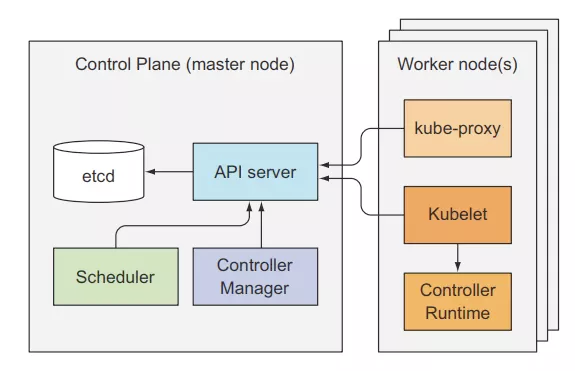

# Architecture

Trong kubernetes cluster sẽ có 2 thành phần chính đó là: master node (còn gọi là control plane) và worker node. 

Trong master node bao gồm 4 thành phần là:

- etcd
- API server
- Controller Manager
- Scheduler

Trong worker node sẽ gồm có 3 thành phần:

- kubelet
- kube-proxy
- container runtime

Ngoài ra, k8s cũng có những add-on khác như:

- K8S Dashboard
- Ingress controller
- ...

### Etcd

- Là một database(dạng key-value) lưu trữ các metadata về các resource mà chúng ta đã tạo trên k8s. 

### API server

- Là thành phần quan trọng nhất k8s, được sử dụng bởi các thành phần khác hoặc client.
- Nó cung cấp một REST API để có thể thực hiện các hành động CRUD(create,read,update,delete) lên cluster state (là các thông tin về resource trong cluster) và lưu state vào etcd.
- API server cũng chịu trách nhiệm authentication, authorization, validation config của các resource.
- Cơ chế khi dùng kubelet để tạo resource, 
    * Đầu tiên, kubelet gửi 1 POST request kèm theo config manifest(tức là các file yaml) của resource tới API Server. 
    * API Server xác thực client này qua Authentication plugin và kiểm tra permission qua Authorization plugin.
    * Tiếp theo, nó sẽ chuyển đổi config manifest sang dạng format mà nó hiểu qua các Admission control plugin.
    * Sau đó, API server sẽ validate các config này xem có đúng hay không, nếu mọi thế đều ok thì resource này sẽ được lưu vào etcd

### Controller Manager

- Controller có nhiệm vụ lắng nghe những thay đổi về resource qua API Server và thực hiện những action tương ứng. (create, update hoặc delete).
- Mỗi controller sẽ thực hiện các công việc khác nhau. Một số controller như: Replicaset, DaemonSet, Deployment

### Scheduler

- Phụ trách việc lựa chọn worker để deploy pod.

### Kubelet

- Là một client tools, có trách nhiệm tương tác với master node và quản lý các container.

### Kube proxy

- Là thành phần quản lý traffic và network của worker node.

### Container runtime

- Là engine để chạy các container. Nổi tiếng nhất là docker, ngoài ra còn có CRI-O, containerd.