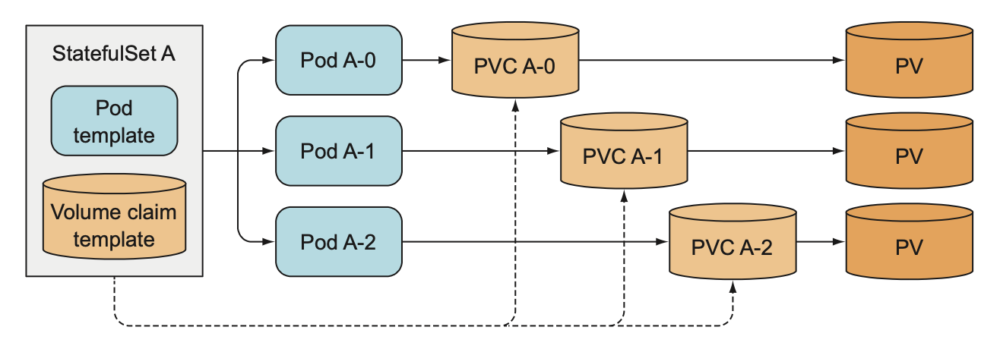

# StatefulSet

Trước tiên, cần hiểu stateful application là những ứng dụng yêu cầu lưu trữ trạng thái (state) hoặc dữ liệu (data) của chính nó. Ví dụ như là database.

## Replicaset stateful pods
Replicaset tạo nhiều pod từ một pod template, do đó những pod này không khác nhau ngoại từ tên và IP. Nếu config volume trong pod template thì tất cả các Pod đều dùng lưu dữ liệu chung một storage.

Nên không thể sử dụng Replicaset để chạy một ứng dụng distributed data store(tức là mỗi instance lưu trữ data hoặc state riêng.)

## StatefulSets

K8S có giải pháp cho vấn đề trên đó là dùng StatefulSets.

StatefulSets cũng giống như ReplicaSet, là resource tạo và chạy nhiều pod cùng một template. Nhưng khác ở chỗ những pod tạo bởi StatefulSet sẽ được định danh và có volume riêng biệt.

Mỗi pod trong StatefulSet sẽ được gán index. Index dùng để định danh cho các pod chứ không phải random như ReplicaSet.


1. Cách statefulset thay thế pod

    Khi pod được quản lý bởi statefulset bị mất thì cũng giống như replicaset, nó sẽ tạo 1 pod khác thay thế, nhưng pod mới này sẽ có tên và hostname giống như thằng cũ đã bị mất(khác với replicaset, khi nó là random)

2. Cách statefulset scale pod

    Bởi vì các pod trong statefulset được đánh index, nên khi

    - scale up: pod mới thêm vào được đánh index là số tiếp theo của index hiện tại.
    - scale down: nó sẽ xoá pod có index lớn nhất.

3. Cách tạo volume riêng cho mỗi pod.

    Để tạo volume cho mỗi pod, Statefulset giải quyết bằng cách tách config volume khỏi pod và sử dụng PersistentVolume. Statefulset sẽ tạo PVC cho mỗi pod và gắn nó vào từng pod tương ứng.

    


    Khi scale up, sẽ có 1 pod và 1 PVC mới được tạo ra.

    Khi scale down, chỉ có pod bị xoá đi, còn PVC không bị xoá, để khi scale up lại thì pod vẫn được gán đúng vào PVC cũ nên dữ liệu không bị mất.


4. Tạo statefulset

    Đầu tiên, phải tạo một headless service(là 1 clusterip service nhưng không tạo ra IP mà chỉ tạo DNS cho các pod, dùng để truy cập chính xác đến pod cụ thể thay vì truy cập qua Service bình thường và gọi random đến các pod).

    ```yaml
    # kubia-service.yaml

    apiVersion: v1
    kind: Service
    metadata:
        name: kubia
    spec:
        clusterIP: None
        selector:
            app: kubia
        ports:
            - name: http
            port: 80
    ```

    Tiếp theo, tạo một statefulset như file config bên dưới.
    ```yaml
    # kubia-stateful.yaml

    apiVersion: apps/v1
    kind: StatefulSet
    metadata:
        name: kubia
    spec:
        serviceName: kubia # headless service name
        replicas: 2
        template: # pod template
            metadata:
                labels:
                    app: kubia
            spec:
                containers:
                    - name: kubia
                    image: luksa/kubia-pet
                    ports:
                        - name: http
                        containerPort: 8080
                volumeMounts:
                    - name: data
                    mountPath: /var/data
        volumeClaimTemplates: # pvc template
            - metadata:
                name: data
            spec:
                resources:
                    requests:
                        storage: 1Mi
                accessModes:
                    - ReadWriteOnce
    ```

    Submit config lên cluster

    ```bash
    $ kubectl apply -f kubia-service.yaml

    $ kubectl apply -f kubia-stateful.yaml
    ```

    Kiểm tra pod và pvc

    ```
    $ kubectl get pods

    NAME     READY  STATUS             RESTARTS  AGE
    kubia-0  1/1    Running            0         10s
    kubia-1  0/1    ContainerCreating  0         3s
    ```

    ```
    $ kubectl get pvc

    NAME          STATUS  VOLUME  CAPACITY  ACCESSMODES  AGE
    data-kubia-0  Bound   pv-0    0                      14s
    data-kubia-1  Bound   pv-1    0                      14s
    ```


