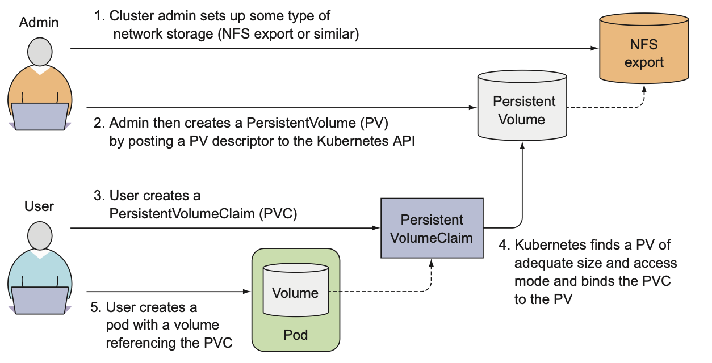

# Volume

Volume hiểu đơn giản là mount point từ một hệ thống file server vào trong container.

Volume không phải là 1 resource của K8S nên không thể tạo và xoá như resource độc lập khác mà volume được define và khởi tạo trong file pod manifest.

Có nhiều loại volume khác nhau, mỗi loại có 1 công dụng riêng không giống nhau.

## emptyDir

Là loại volume đơn giản nhất dùng để share data giữa các container trong cùng một pod.

Volume này chỉ tồn tại trong lifecycle của pod, khi pod bị xoá → volume cũng bị mất.

- Tạo pod với emptyDir volume
    
    ```yaml
    # emptyDir-volume.yaml

    apiVersion: v1
    kind: Pod
    metadata:
        name: fortune
    spec:
        containers:
        - image: luksa/fortune
            name: html-generator
            volumeMounts:
            - name: html
                mountPath: /var/htdocs
        - image: nginx:alpine
            name: web-server
            volumeMounts:
            - name: html
                mountPath: /usr/share/nginx/html
                readOnly: true
            ports:
            - containerPort: 80
        volumes:
        - name: html
            emptyDir: {}
    ```
    
    Ở đây, ta có 2 container(`html-generator` tự động tạo file html, `web-server` serving file html) và 1 emptyDir volume là html, volume này được mount vào container `html-generator` ở folder `/var/htdocs`, đồng thời nó cũng được mount vào container `web-server` ở folder `/usr/share/nginx/html`. Do đó, khi `html-generator` tạo file html thì bên trong `web-server` sẽ nhìn thấy file này và serving cho client.
    

## gitRepo & hostPath

gitRepo: là loại volume giống emptyDir, nó sẽ tạo ra một empty folder trong pod và clone code trên git về repo này.

hostPath: Là loại volume moun mount từ pod ra ngoài file system của worker node. Dữ liệu trong volume này chỉ tồn tại trên worker node. Tuy nhiên, data sẽ bị mất nếu pod được deploy ở một node khác.

- Tạo pod với gitRepo & hostPath volume

  ```yaml
  apiVersion: v1
  kind: Pod
  metadata:
    name: hostpath-volume
  spec:
    containers:
      - image: nginx:alpine
        name: web-server
        volumeMounts:
          - name: html
            mountPath: /usr/share/nginx/html
            readOnly: true
          - name: log # log volume
            mountPath: /var/log/nginx # mounted at /var/log/nginx in the container
        ports:
          - containerPort: 80
            protocol: TCP
    volumes:
      - name: html
        gitRepo: # gitRepo volume
          repository: https://github.com/luksa/kubia-website-example.git # The volume will clone this Git repository
          revision: master # master branch
          directory: . # cloned into the root dir of the volume.
      - name: log
        hostPath: # hostPath volume
          path: /var/log # folder of woker node
  ```

## Cloud Storage

Đây là loại volume để lưu trữ persistent data, dữ liệu vẫn tồn tại cho các container kể cả khi pod đã bị xoá. Loại volume này chỉ hỗ trợ trên các nền tảng cloud (aws, azure, gcp, ...). Ứng với mỗi cloud platform sẽ có những property khác nhau (aws có awsElasticBlockStore, azure có azureDisk, ...)

- Ví dụ tạo pod với aws volume:
    
    ```yaml
    apiVersion: v1
    kind: Pod
    metadata:
      name: mongodb
    spec:
      containers:
        - image: mongo
          name: mongodb
          volumeMounts:
            - name: mongodb-data
              mountPath: /data/db
          ports:
            - containerPort: 27017
      volumes:
        - name: mongodb-data
          awsElasticBlockStore: 
            volumeID: vol-xxx
            fsType: ext4
    ```
    

## PersistentVolumes & PersistentVolumeClaims

Do không phải ai cũng biết các kiến trúc lưu trữ bên dưới của worker node nên Kubernetes cung cấp cho chúng ta 2 resource dùng để tách kiến trúc lưu trữ này khi khởi tạo pod. Tức là tạo pod mà không cần quan tâm sẽ sử dụng công nghệ gì để lưu trữ.
- PersistentVolumes(PV) là resource sẽ tương tác với kiến trúc lưu trữ.
- PersistentVolumeClaims(PVC) sẽ request storage từ PersistentVolumes.

Thông thường trên một hệ thống k8s cluster sẽ có 2 role là:
- Administrator: là người triển khai và quản lý k8s, cài những add-on cần thiết, sẽ là người quyết định công nghệ lưu trữ.
- Developer: là những người viết file config yaml để deploy application lên cluster, tức là những người sử dụng không cần quan tâm đến công nghệ lưu trữ phía sau.

Một kubernetes administrator sẽ là người setup kiến trúc storage bên dưới và tạo các PersistentVolumes để cho kuberetes developer request và sử dụng.



Các bước để khởi tạo PV và PVC

- Bước 1: Administrator khởi tạo PersistentVolume `mongodb-pv` với capacity là 10GB trên cluster:
        
  ```yaml
  # persistent-volume.yaml

  apiVersion: v1
  kind: PersistentVolume
  metadata:
    name: mongodb-pv
  spec:
    capacity:
      storage: 10Gi
    accessModes:
      - ReadWriteOnce
      - ReadOnlyMany
    persistentVolumeReclaimPolicy: Retain
    awsElasticBlockStore: 
      volumeID: vol-0d4d4ef91a4fd03ae
      fsType: ext4
  ```
        
    Ở đây Administrator cần phải chỉ định size cho PV và các access mode cho nó. Ngoài ra còn sử dụng loại công nghệ lưu trữ là gì cloud hay on-premise.
        
- Bước 2: Developer khởi tạo PersistentVolumeClaims `mongo-pvc` để tiêu thụ PersistentVolume.
        
  ```yaml
  # persistent-volume-claims.yaml

  apiVersion: v1
  kind: PersistentVolumeClaim
  metadata:
    name: mongo-pvc
  spec:
    resources:
      requests:
        storage: 10Gi
    accessModes:
      - ReadWriteOnce
    storageClassName: ""
  ```
        
  Ở đây, developer tạo 1 PVC có capacity là 10GB storage, nếu có PV nào đáp ứng được yêu cầu này thì PVC được bind vào PV đó.
        
- Bước 3: Tạo resource
  ```bash
  # tạo persistent volume
  $ kubectl create -f persistent-volume.yaml
  persistentvolume/mongodb-pv created

  # tạo persistent volume claims
  $ kubectl create -f persistent-volume-claims.yaml
  persistentvolumeclaim/mongo-pvc created
  ```

- Bước 4: Kiểm tra xem các resource đã được tạo hay chưa.
    
  ```bash
  $ kubectl get pvc
  NAME        STATUS   VOLUME       CAPACITY   ACCESS MODES   STORAGECLASS   AGE
  mongo-pvc   Bound    mongodb-pv   10Gi       RWO,ROX                       112s

  
  $ kubectl get pv
  NAME         CAPACITY   ACCESS MODES   RECLAIM POLICY   STATUS   CLAIM               STORAGECLASS   REASON   AGE
  mongodb-pv   10Gi       RWO,ROX        Retain           Bound    default/mongo-pvc                           3m21s

  # pvc đã được bind vào pv(ở colume CLAIM)
  ```
        
- Bước 5: Tiếp theo Developer sẽ tạo pod mà sử dụng PVC
    
    ```yaml
    # mongodb-pod.yaml

    apiVersion: v1
    kind: Pod
    metadata:
      name: mongodb
    spec:
      containers:
        - image: mongo
          name: mongodb
          volumeMounts:
            - name: mongodb-data
              mountPath: /data/db
          ports:
            - containerPort: 27017
      volumes:
        - name: mongodb-data
          persistentVolumeClaim:
            claimName: mongodb-pvc
    ```

    Tạo pod
    ```
    $ kubectl create -f mongodb-pod.yaml
    ```
        

### Recycling PersistentVolume

Khi tạo PersistentVolume(PV), Administrator sử dụng thuộc tính persistentVolumeReclaimPolicy, có 3 giá trị là retain, recycle và delete.
Trong đó:
- retain: tức là khi xoá PVC, thì PV vẫn còn nhưng ở trạng thái Release(tức là đã có dữ liệu) → nếu có một PVC khác bind vào sẽ gây ra lỗi.
- recycle: khi xoá PVC, PV vẫn tồn tại, nhưng lúc này data trong PV cũng bị xoá đi luôn → PVC mới có thể bind vào.
- delete: khi xoá PVC thì xoá luôn PV.

### Dynamic Provisioning PersistentVolume

Khi tạo và sử dụng PersistentVolume, Administrator vẫn cần phải tạo PV thủ công xong thì Developer mới sử dụng được. 

Tuy nhiên k8s có hỗ trợ cách để tạo PV một cách tự động. Đó là sử dụng StorageClass với một provisioner (được hỗ trợ mặc định khi sử dụng k8s trên cloud, còn các môi trường khác phải tự cài các provisioner này).


Ví dụ StorageClass với AWS provisioner

  - Tạo StorageClass (có tên là `fast`):

    ```yaml
    # storageclass.yaml

    apiVersion: storage.k8s.io/v1
    kind: StorageClass
    metadata:
      name: fast
    provisioner: kubernetes.io/aws-ebs
    parameters:
      type: gp2
      fsType: ext4
    ```
    
- Tiếp theo, tạo PVC sử dụng storage class này
    
    ```yaml
    # pvc.yaml

    apiVersion: v1
    kind: PersistentVolumeClaim
    metadata:
      name: mongo-pvc
    spec:
      resources:
        requests:
          storage: 10Gi
      accessModes:
        - ReadWriteOnce
      storageClassName: fast
    ```

- Tạo các resource
  
  ```bash
  $ kubectl create -f storageclass.yaml
  storageclass.storage.k8s.io/fast created

  $ kubectl create -f pvc.yaml
  persistentvolumeclaim/mongo-pvc created
  ```

  Để kiểm tra, ta lên AWS Console → EC2 → EBS sẽ thấy có 1 volume được tạo mới, chính là PersistentVolume mà provisioner đã tự động khởi tạo cho chúng ta.

